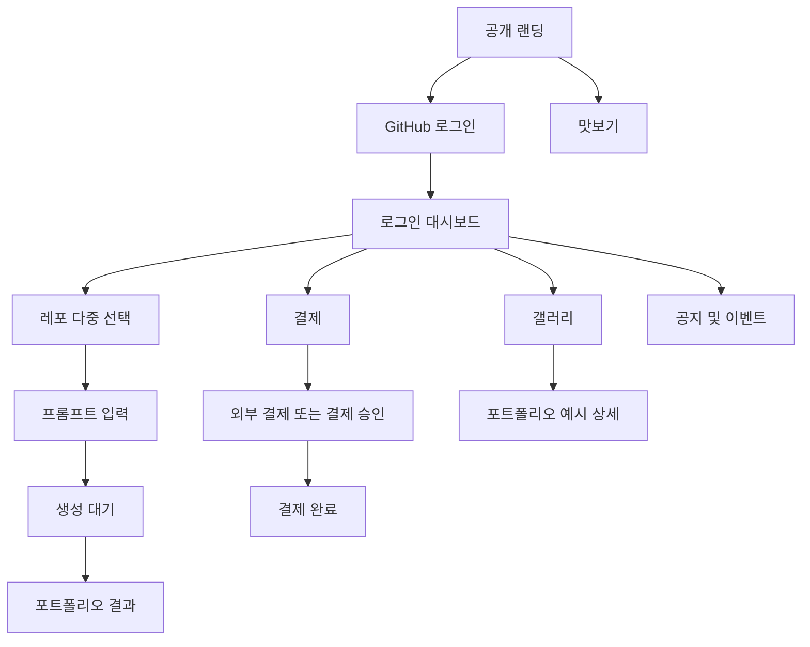
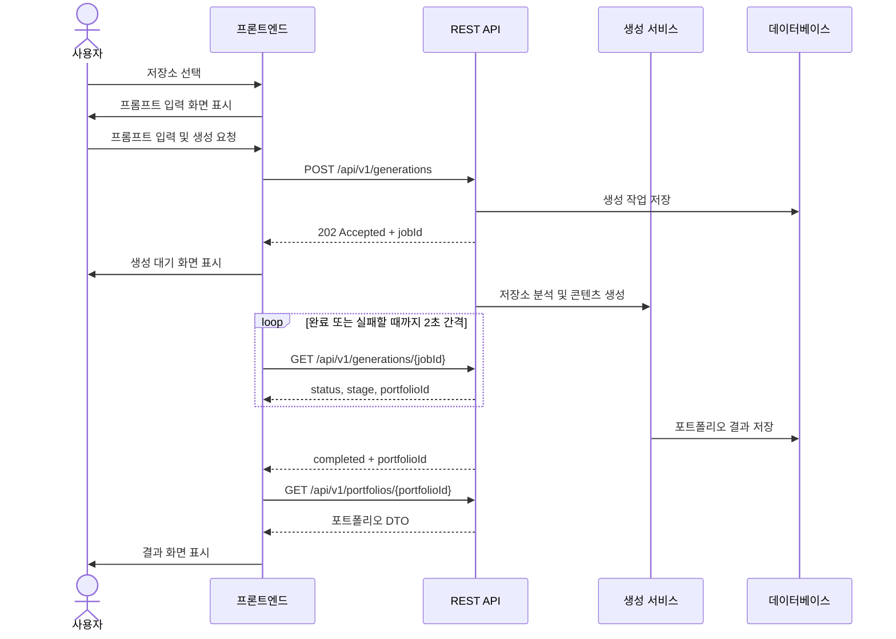
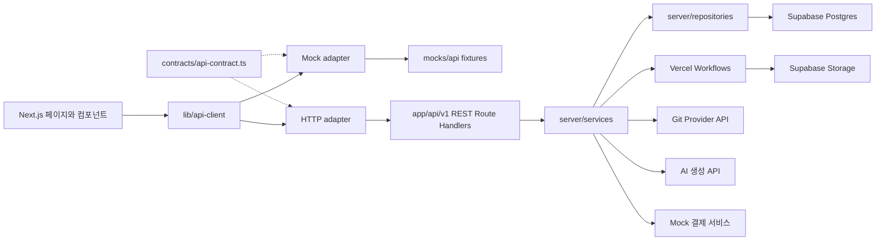

# 취업 포트폴리오 AI 아키텍처

## 1. 문서 목적

이 문서는 취업 포트폴리오 AI MVP의 화면 구조, 사용자 흐름, 프론트엔드·백엔드 경계, REST API와 핵심 데이터 모델을 정의한다. 프론트엔드와 백엔드는 이 문서를 공통 구현 기준으로 사용한다.

## 2. 제품 구조 요약

공개 랜딩을 서비스의 첫 화면으로 사용하고 로그인한 사용자는 대시보드에서
포트폴리오 생성, 결제, 갤러리와 최근 작업으로 이동한다.



## 3. 기본 제품 결정

- `/`를 비로그인 사용자도 접근할 수 있는 공개 랜딩으로 사용한다.
- `/dashboard`는 GitHub 로그인 사용자의 작업 공간으로 사용한다.
- 랜딩, 맛보기, 갤러리와 공지 조회는 로그인 없이 접근할 수 있다.
- 로그인과 저장소 연동은 GitHub OAuth만 사용한다. MVP에서는 다른 로그인 또는 Git 제공자를 지원하지 않는다.
- 실제 Git 저장소 연결과 포트폴리오 저장은 로그인이 필요하다.
- 대시보드 내부 페이지는 공통 헤더와 내비게이션을 공유한다.
- 포트폴리오 생성은 비동기 작업으로 처리하고 REST API polling으로 상태를 확인한다.
- MVP 결제와 크레딧은 모두 mock으로 구현하며 실제 결제, 크레딧 지급 또는 차감을 수행하지 않는다.
- 신규 사용자의 표시 잔액은 100크레딧이고, 선택한 저장소 한 개당 예상
  비용은 30크레딧이다. MVP에서는 선택 개수에 따라 예상값만 계산한다.
- 갤러리는 초기에는 운영자가 준비한 포트폴리오 예시를 노출한다. 사용자 공개 갤러리는 MVP 이후 범위로 둔다.

## 4. 라우트 구조

| 경로 | 접근 | 역할 |
| --- | --- | --- |
| `/` | 공개 | 서비스 소개, GitHub 로그인 CTA와 정적 맛보기 |
| `/dashboard` | 로그인 | 최근 작업, 공지와 생성 진입점을 제공하는 작업 공간 |
| `/portfolios` | 로그인 | 내가 만든 포트폴리오 목록. 열기와 삭제 |
| `/p/[slug]` | 공개 | 소유자가 공개한 포트폴리오. 로그인 불필요 |
| `/repositories` | 로그인 | 연결된 Git 저장소를 하나 이상 선택 |
| `/create/[repositoryId]/prompt` | 로그인 | 선택한 저장소 묶음과 생성 프롬프트 입력 |
| `/create/[jobId]/processing` | 로그인 | 생성 진행 상태 확인 |
| `/portfolios/[portfolioId]` | 소유자 | 생성된 포트폴리오 결과 확인 |
| `/billing` | 로그인 | 크레딧 확인과 결제 상품 선택 |
| `/billing/success` | 로그인 | 결제 성공 확인 |
| `/billing/cancel` | 로그인 | 결제 취소 또는 실패 안내 |
| `/gallery` | 공개 | 포트폴리오 예시 그리드 |
| `/gallery/[exampleId]` | 공개 | 포트폴리오 예시 상세 |
| `/announcements/[announcementId]` | 공개 | 공지 또는 이벤트 상세 |

Next.js App Router의 라우트 그룹을 사용해 대시보드 레이아웃을 공유한다.

```text
app/
├── page.tsx
├── layout.tsx
├── (dashboard)/
│   ├── layout.tsx
│   ├── dashboard/page.tsx
│   ├── portfolios/page.tsx
│   ├── repositories/page.tsx
│   ├── create/
│   │   └── [id]/
│   │       ├── prompt/page.tsx
│   │       └── processing/page.tsx
│   ├── portfolios/[portfolioId]/page.tsx
│   ├── billing/
│   │   ├── page.tsx
│   │   ├── success/page.tsx
│   │   └── cancel/page.tsx
│   └── gallery/
│       ├── page.tsx
│       └── [exampleId]/page.tsx
├── announcements/[announcementId]/page.tsx
└── api/v1/
```

Next.js는 같은 동적 경로 위치에 서로 다른 parameter 이름을 허용하지 않는다.
따라서 파일 시스템에서는 공통 `[id]`를 사용하고, `prompt` 페이지는 이를
`repositoryId`로, `processing` 페이지는 `jobId`로 해석한다.

## 5. 공통 대시보드 레이아웃

대시보드 계열 페이지는 다음 요소를 공유한다.

- 상단 헤더
  - 서비스 로고와 이름
  - 현재 크레딧
  - 로그인 또는 사용자 메뉴
- 내비게이션
  - 대시보드
  - 내 포트폴리오
  - 포트폴리오 만들기
  - 갤러리
  - 크레딧
- 본문
  - 각 페이지의 주요 콘텐츠
- 전역 피드백
  - 성공·오류 알림
  - 인증 만료 안내

모바일에서는 내비게이션을 접을 수 있는 메뉴 또는 하단 탭으로 제공한다.

## 6. 페이지별 구성

### 6.0 공개 랜딩

공개 랜딩은 로그인 전 서비스 가치와 결과물을 설명하는 화면이다.

구성 순서:

1. 서비스 소개 hero와 GitHub 로그인 CTA
2. 회원가입 없이 GitHub로 시작할 수 있다는 안내
3. 정적 샘플 저장소, 프롬프트와 완성 결과 맛보기
4. 갤러리 진입 링크

로그인이 완료되면 `/dashboard`로 이동한다. 로그인 사용자가 `/`에 접근하면
세션 확인 후 즉시 `/dashboard`로 이동시키며 공개 랜딩은 노출하지 않는다.
랜딩의 주요 CTA 문구와 목적지는 GitHub 로그인으로 통일한다.

### 6.1 대시보드

대시보드는 로그인한 사용자가 작업 현황을 확인하고 다음 행동을 선택하는
개인 작업 공간이다. 공개 랜딩의 hero와 맛보기는 대시보드에서 반복하지 않는다.

구성 순서:

1. 서비스 현황
   - 현재 mock 크레딧, 저장소당 예상 비용과 최근 결과 수를 본다.
2. 진입점
   - 가장 강조된 `포트폴리오 만들기` 버튼
   - 로그인 상태면 `/repositories`로 이동한다.
   - 비로그인 상태면 로그인 후 `/repositories`로 복귀한다.
3. 공지 및 이벤트
   - 최신 공지와 이벤트를 카드 또는 리스트로 노출한다.
   - 중요도와 게시일을 표시한다.
4. 최근 작업
   - 최근 포트폴리오 3건을 노출한다.
   - 전체 목록은 `/portfolios`에서 본다. 대시보드에 `전체 보기` 링크를 둔다.

주요 상태:

- 로그인 완료, 생성 이력 없음
- 로그인 완료, 최근 작업 있음
- 공지 없음
- 데이터 조회 실패

### 6.2 레포 선택

목적은 연결된 Git 저장소 중 포트폴리오 생성에 사용할 저장소를 하나 이상
선택하는 것이다.

구성:

- Git 계정 연결 상태
- 저장소 검색
- 전체·공개·비공개 필터
- 저장소 카드 또는 리스트
  - 저장소 이름
  - 설명
  - 주 언어
  - 최근 업데이트
  - 공개 여부
- 저장소 새로고침
- 선택한 저장소 수와 예상 mock 비용을 보여주는 고정 선택 요약
- 선택 완료 후 프롬프트 화면으로 이동하는 CTA
- 빈 상태와 연결 오류 안내

사용자가 저장소 카드를 클릭하면 선택 상태를 토글한다. 한 번에 최대 5개까지
선택할 수 있고, 상한에 도달하면 추가 선택을 무시한다. 첫 저장소 ID를 경로에
유지하고 전체 선택 ID는 query string으로 전달한다.

다중 저장소 생성은 `POST /api/v1/generations`의 `repositoryIds` 배열로 요청한다.
저장소 하나가 프로젝트 하나가 되며, 선택 순서가 프로젝트 순서다. 작업과
포트폴리오는 `generation_job_repositories`, `portfolio_repositories` 연결
테이블로 저장소 목록을 갖고, 기존 `repository_id` 컬럼은 대표(첫 번째)
저장소로 유지한다.

생성 결과의 각 프로젝트는 모델이 적어 보낸 `repositoryName`으로 원래 저장소에
다시 연결한다. 이름이 어긋나면 아직 쓰이지 않은 저장소를 순서대로 배정해
저장소가 중복 배정되지 않게 한다.

### 6.3 프롬프트 입력

구성:

- 선택한 저장소 목록과 개수 요약
- 사용 목적 또는 지원 직무
- 강조하고 싶은 경험
- 자유 프롬프트 입력란
- 예상 크레딧 사용량
- `포트폴리오 생성` 버튼
- `저장소 다시 선택` 버튼

필수 입력:

- `repositoryIds` (1~5개, 선택 순서 유지)
- `prompt`

선택 입력:

- `targetRole`
- `tone`
- `highlights`

생성 요청이 성공하면 서버가 `jobId`를 반환하고 `/create/[jobId]/processing`으로 이동한다.

### 6.4 생성 대기

페이지를 새로고침해도 진행 상태를 복구할 수 있도록 URL에 `jobId`를 포함한다.

진행 단계:

1. `queued`: 생성 요청 접수
2. `analyzingRepository`: 저장소 분석
3. `generatingContent`: 포트폴리오 콘텐츠 생성
4. `renderingPortfolio`: 결과 화면 구성
5. `completed`: 생성 완료
6. `failed`: 생성 실패

화면 구성:

- 현재 진행 단계
- 진행 안내 문구
- 단계형 progress UI
- 취소 또는 대시보드 이동
- 실패 시 오류 안내와 재시도 버튼

프론트엔드는 2초 간격으로 생성 상태 API를 호출한다. 완료되면 응답의 `portfolioId`를 사용해 `/portfolios/[portfolioId]`로 이동한다. 연속 오류가 발생하면 polling을 중단하고 재시도 UI를 표시한다.

### 6.5 내 포트폴리오 목록

`/portfolios`는 사용자가 만든 포트폴리오 전체를 보는 화면이다. 대시보드는
최근 3건만 보여주므로 그보다 많이 만들면 이 화면에서만 전부 확인할 수 있다.

구성:

- 카드 그리드
  - 직무와 생성일
  - 포트폴리오 제목
  - 대표 저장소 이름. `repositoryCount`가 2 이상이면 "외 N개"를 덧붙인다.
  - 기술 태그 일부
  - 열기 링크와 삭제
- 빈 상태와 첫 생성 CTA
- `hasNextPage`일 때 더 보기

카드 전체를 링크로 감싸지 않는다. 삭제 버튼이 링크 안에 중첩되면 접근성이
깨지므로, 본문만 링크로 두고 삭제는 형제 요소로 둔다.

삭제는 결과 화면과 같은 규약을 따른다. 브라우저 확인 대화상자를 쓰지 않고
해당 카드 자리에서 한 번 더 확인받는다.

`GET /api/v1/portfolios`는 커서 페이지네이션을 쓰므로 API client는 응답의
`data`뿐 아니라 `meta`의 `nextCursor`와 `hasNextPage`도 함께 돌려줘야 한다.
그러지 않으면 목록이 기본 20건에서 조용히 잘린다.

### 6.6 포트폴리오 결과

구성:

- 생성된 포트폴리오 미리보기
- 프로젝트와 기술 스택
- Git 활동을 기반으로 생성된 주요 성과
- 자기소개 또는 요약
- 사용된 저장소 정보
- 다시 생성
- 인쇄와 PDF 저장
- 삭제
- 대시보드로 이동

MVP에서는 하나의 고정 스타일을 제공한다. 결과는 이름과 핵심 소개, 역량,
프로젝트별 문제·접근·성과, Git 분석과 연락처 순서로 빠르게 훑을 수 있는
단일 컬럼 중심 레이아웃을 사용한다. 스타일 선택과 세부 편집은 이후 확장
범위로 둔다.

#### 공개 공유

소유자가 공개를 켜면 `/p/[slug]`로 누구나 볼 수 있다. 취업용 포트폴리오는
채용 담당자에게 보낼 수 있어야 목적을 달성한다.

- `PUT /api/v1/portfolios/{portfolioId}/share`로 공개 여부를 전환한다.
- `GET /api/v1/public/portfolios/{slug}`는 **인증이 없다.** 조회 함수에
  `published_at is not null` 조건을 박아 비공개 결과가 새지 않게 한다.
- 슬러그는 처음 공개할 때 만들고 이후 유지한다. 비공개로 되돌려도 지우지
  않아, 다시 공개하면 이미 보낸 링크가 그대로 살아난다.
- 공개 응답에는 소유자를 식별할 값을 담지 않는다. 포트폴리오 id, 생성 작업
  id, 내부 저장소 id를 제외하고 저장소는 이름과 공개 URL만 담는다.
- 공개 페이지는 대시보드 레이아웃 밖에 둔다. 비로그인 방문자에게 크레딧
  표시나 내비게이션이 보이면 안 된다.
- 링크를 채팅이나 메일에 붙였을 때 미리보기가 떠야 하므로 서버 컴포넌트로
  두고 `generateMetadata`에서 이름과 한 줄 소개를 채운다.

연락처는 공개 페이지에도 싣는다. 연락할 수단이 없으면 공유의 의미가 없다.

#### 삭제

`DELETE /api/v1/portfolios/{portfolioId}`는 소유자만 호출할 수 있고 되돌릴 수
없다. 생성 작업 기록은 남으며
`generation_jobs.portfolio_id`만 비워진다.

화면은 브라우저 확인 대화상자를 쓰지 않고, 삭제 버튼을 누르면 같은 자리에서
"되돌릴 수 없어요"를 보여준 뒤 한 번 더 확인받는다.

#### 미리보기 페이지 분할

결과 문서는 화면에서도 A4 낱장으로 나눠 보여준다. 인쇄 미리보기와 같은 모습이라
어디서 페이지가 넘어가는지 미리 알 수 있다.

인쇄 CSS가 히어로·지표·프로젝트 카드·역량 섹션에 `break-inside: avoid`를 걸어
두었으므로 인쇄 엔진도 같은 블록을 통째로 배치한다. 화면 분할은 같은 블록 단위로
높이를 쌓아 나눈다. 프로젝트는 카드 하나가 단위다. 섹션을 통째로 묶으면 앞 페이지에
빈 공간이 크게 남는다.

측정용 사본은 실제 낱장과 같은 클래스를 써야 한다. `.result-portfolio-preview`가
문서 토큰과 컨테이너 쿼리 기준을 갖고 있어, 이 래퍼가 없으면 여백과 반응형이 달라져
높이가 어긋난다.

폰트와 이미지가 늦게 뜨면 높이가 달라지므로 둘이 준비된 뒤 다시 측정한다. 좁은 화면
에서는 낱장이 그대로 들어가지 않으므로 폭에 맞춰 축소한다.

브라우저 인쇄 엔진과 완전히 같지는 않다. 몇 px 차이는 날 수 있으나 페이지가 넘어가는
지점은 같다.

페이지 배치 규칙은 두 가지다. 한 장에 프로젝트를 셋 이상 담지 않고, 남는 공간은
블록 사이로 나눠 넣어 아래쪽에 큰 여백이 남지 않게 한다. 나눠 넣는 여백은 인라인
값이라 인쇄에도 그대로 적용되어 나눔 지점이 어긋나지 않는다. 마지막 장은 문서가
끝난 자리이므로 늘리지 않는다.

프로젝트와 역량은 화면에서도 인쇄에서도 중간에서 끊지 않는다. 대신 카드 내부
간격을 조여 한 장에 두 개가 들어가도록 맞춘다.

**낱장 시뮬레이션은 화면 전용이다.** 인쇄에서는 끄고 인쇄 엔진이 스스로 나누게
둔다. 그러지 않으면 측정용 사본이 페이지 박스를 늘려 빈 페이지가 생기고, 낱장
여백과 페이지 여백이 겹쳐 종이에 담기는 내용이 줄어든다. 화면용 페이지 번호와
낱장 사이 여백도 인쇄에 새어 나온다.

인쇄에서는 목차와 푸터를 감춘다. 종이에서 "Back to top"은 쓸모가 없다. 세로
리듬도 좁혀 한 장에 더 담는다. 브라우저가 머리말·꼬리말을 켜면 쓸 수 있는 높이가
더 줄어들므로 장수는 인쇄 설정에 따라 달라진다.

#### 인쇄 규격과 문서 폭

결과 화면은 인쇄(A4 세로)와 같은 폭에서 보여준다. `@page`는 A4 세로에 여백
10mm를 쓰고, 문서 폭은 그 본문 폭인 718px로 고정한다. 화면과 인쇄가 같은
폭이므로 줄바꿈과 열 구성이 어긋나지 않는다.

폭이 고정되면 뷰포트 기준 미디어 쿼리는 문서 안에서 의미가 없다. 결과 문서의
반응형은 `@container result`로 문서 자신의 폭에 반응하게 한다.

브라우저는 기본적으로 배경색을 인쇄하지 않는다. 어두운 배경에 밝은 글자를 쓴
영역을 그대로 두면 백지에 흰 글씨가 되어 내용이 사라진다. 인쇄에서는 해당
영역을 밝은 배색으로 전환하고, 배경으로 그린 그래프는 테두리와 진한 채움으로
바꾼다.

페이지가 넘어갈 때 항목이 잘리지 않도록 프로젝트 카드와 역량 섹션에
`break-inside: avoid`를 준다. 프로젝트 목록은 여러 개일 때 자연스럽게 페이지를
넘어간다.

#### 여백 기준선

문서의 모든 본문은 하나의 좌우 기준선(`--doc-gutter`)에서 시작한다. 내비게이션,
히어로, 지표 띠, 각 섹션, 푸터가 같은 선을 쓴다. 프로필 사진은 이름 줄에만
붙이고 그 아래 문단은 기준선을 지킨다.

프로젝트와 문제·접근 항목은 상자로 감싸지 않고 구분선으로 나눈다. 상자를
중첩하면 들여쓰기가 겹쳐 기준선이 무너지고 인쇄에서 잉크만 늘어난다.

#### 타이포그래피와 밀도

결과 화면은 채용 담당자가 훑어 읽는 문서이므로 밀도를 우선한다. 크기는
`app/globals.css`의 `:root` 토큰(`--text-*`, `--space-*`)만 사용하고 파일 안에
숫자를 직접 쓰지 않는다.

| 대상 | 토큰 | 값 |
| --- | --- | --- |
| 이름 | `--text-2xl` | 30px |
| 프로젝트 제목 | `--text-lg` | 20px |
| 본문·소개 | `--text-md` / `--text-base` | 16px / 15px |
| 보조 설명 | `--text-sm` | 13px |
| 섹션 라벨·태그 | `--text-2xs` | 11px |

- 한국어 본문 행간은 1.6~1.7을 사용한다.
- 제목은 30px을 넘지 않는다. 장식용 대형 문구와 맺음말 섹션은 두지 않는다.
- 화면에 나오는 문장은 모두 생성 결과 데이터에서 나와야 한다. 값이 없으면
  기본 문구로 대체하지 않고 해당 항목을 렌더링하지 않는다. 특히 연락처의
  `location`처럼 비어 있을 수 있는 값에 예시 문자열을 넣지 않는다.
- 배열이 빈 항목은 라벨과 컨테이너까지 렌더링하지 않는다.

#### 생성 콘텐츠 분량 규격

밀도를 유지하려면 생성 단계에서 분량이 정해져야 한다. 아래 상한은 채워야 할
목표가 아니라 넘지 말아야 할 한계이며, 근거가 부족하면 더 적게 쓰거나 빈
배열을 반환한다.

| 필드 | 상한 |
| --- | --- |
| `profile.headline` | 60자 |
| `introduction` | 150자 |
| `project.description` | 120자 |
| `project.highlights` | 3개 / 항목 60자 |
| `project.challenges`·`solutions`·`impact` | 각 2개 / 항목 80자 |
| `project.techStack` | 8개 |
| `skills` | 4개 그룹 / 그룹당 6개 |
| `gitAnalysis.notablePatterns` | 4개 |

상한은 채용 담당자가 읽을 수 있는 한계이지 목표가 아니다. 다만 확인된 사실이
남아 있는데 생략하면 경험이 실제보다 얇아 보이므로, 근거가 충분할 때는 상한까지
쓴다.

`impact`는 수치가 없어도 된다. README나 활동 제목에서 확인되는 변화를 사실대로
쓰되 제공되지 않은 수치는 만들지 않는다. `notablePatterns`는 커밋과 PR 제목에서
드러나는 작업 방식을 담으며 저장소 전체를 아우른다.

#### 상단 지표

상단 띠에는 채용 담당자가 판단에 쓰는 것만 남긴다.

| 지표 | 값 | 없을 때 |
| --- | --- | --- |
| Primary language | 주 언어 | 칸을 만들지 않는다 |
| Core stack | 여러 프로젝트에 반복 등장하는 기술 상위 3개 | 칸을 만들지 않는다 |
| Last activity | 선택한 저장소 중 가장 최근 push 시점 | 칸을 만들지 않는다 |

프로젝트 수는 아래 카드를 세면 알 수 있고, 기술 개수는 많다고 좋은 것이 아니며,
별과 fork 수는 개인 프로젝트에서 대부분 0이라 오히려 약해 보인다. 셋 다 띠에서
제외한다. 칸 수는 데이터에 따라 달라지므로 있는 만큼 고르게 나눈다.

규격은 세 곳에서 함께 지킨다. 생성 지침(`server/openai/portfolio-prompt.ts`),
JSON schema의 `maxItems`(`server/openai/portfolio-generator.ts`), 그리고 응답을
DTO로 옮길 때의 방어적 자르기(`server/portfolio/mapper.ts`)다. 규격 이전에
저장된 결과도 마지막 단계에서 상한이 적용된다.

### 6.7 결제

결제 페이지는 구매 가능한 mock 상품과 최근 체험 내역을 바로 보여준다.

구성:

- 크레딧 상품 카드
- 상품별 가격과 제공 크레딧
- 선택한 상품 요약
- 결제 버튼
- 최근 결제 내역
- 상품 영역 안의 mock 결제 안내

MVP의 결제 버튼은 mock checkout API를 호출하고 `/billing/success`로 이동한다. 응답과 화면에는 `isMock: true`를 명확히 표시하며 실제 승인, 크레딧 지급 또는 잔액 변경은 발생하지 않는다.

신규 사용자의 표시 잔액은 100크레딧이다. 선택한 저장소 수에 30을 곱해
예상 비용을 계산하지만 MVP에서는 실제로 차감하지 않으며 생성 후 잔액도
100으로 유지한다.

### 6.8 갤러리

갤러리는 완성된 포트폴리오 예시를 카드 그리드로 보여준다.

구성:

- 갤러리 제목과 설명
- 직무 또는 기술 스택 필터
- 반응형 그리드
  - 모바일 1열
  - 태블릿 2열
  - 데스크톱 3~4열
- 포트폴리오 카드
  - 썸네일
  - 포트폴리오 제목
  - 직무
  - 주요 기술 태그
  - 스타일 정보
- 더 보기 또는 cursor pagination

카드를 클릭하면 `/gallery/[exampleId]`에서 전체 포트폴리오 예시를 확인한다. 초기 갤러리 데이터는 운영자가 승인한 정적 예시 또는 DB seed 데이터로 구성한다.

## 7. 포트폴리오 생성 흐름



## 8. 시스템 레이어



레이어 규칙:

- UI는 `lib/api-client`의 공통 인터페이스를 통해서만 데이터를 요청한다.
- UI는 `fetch`, mock fixture, HTTP adapter를 직접 사용하지 않는다.
- mock과 HTTP adapter는 모두 `contracts/api-contract.ts`의 동일 DTO를 반환한다.
- Route Handler는 요청 파싱, 인증 확인과 HTTP 응답 변환을 담당한다.
- 비즈니스 로직은 `server/services/**`에 둔다.
- DB 쿼리는 `server/repositories/**` 또는 `db/**`로 제한한다.
- 외부 Git과 AI 제공자 코드는 adapter로 분리한다. 실제 결제를 연결할 때도 동일한 adapter 경계를 사용한다.
- 외부 서비스의 응답 타입을 UI나 DB 모델로 직접 사용하지 않는다.

### 8.2 백엔드 실행 구조

MVP 백엔드는 Vercel Functions와 Supabase Postgres를 기준으로 구현한다. 장시간 실행되는
저장소 분석과 AI 생성은 HTTP 요청 안에서 처리하지 않고 Vercel Workflow로 실행한다.

| 구성 요소 | 책임 |
| --- | --- |
| Vercel Functions | REST Route Handler, 세션 검증, 입력 검증과 응답 변환 |
| Supabase Postgres | 사용자, Git 연결, 저장소 메타데이터, 생성 작업과 결과 저장 |
| Vercel Workflows | 분석, 콘텐츠 생성과 포트폴리오 저장 단계 실행 및 재시도 |
| Supabase Storage | 향후 사용자 업로드 문서의 비공개 저장 |

생성 흐름은 다음 순서를 따른다.

1. `POST /api/v1/generations`가 Postgres에 `queued` 작업을 만들고 Workflow를 시작한다.
2. Workflow가 Postgres의 단계와 진행률을 갱신하며 GitHub 데이터를 분석한다.
3. AI 생성 결과를 구조화된 포트폴리오 콘텐츠로 저장한다.
4. 포트폴리오 결과를 저장한 뒤 작업을 `completed`로, 결과를 조회 가능 상태로 갱신한다.

재시도는 실패한 작업에 새 Workflow와 새 `GenerationJob`을 만들며, 기존 작업의
결과를 덮어쓰지 않는다. 프론트엔드는 기존 polling 계약으로 Postgres에 저장된 상태를
조회한다.

GitHub OAuth callback은 access token을 API 응답이나 로그에 포함하지 않는다.
`GitConnection`에는 암호화된 token, 암호화 초기화 벡터, 권한 범위와 연결 시각을
서버 전용으로 저장한다. 암호화 키는 Vercel Environment Variable로만 제공하고 `NEXT_PUBLIC_`
환경변수나 클라이언트 모듈에 두지 않는다.

PDF는 서버에서 만들지 않는다. 결과 문서가 A4 세로 규격이므로 브라우저 인쇄의
"PDF로 저장"이 그대로 규격에 맞는 파일을 만든다. 서버 렌더링과 파일 보관을 두지
않아 저장 비용과 정리 책임이 생기지 않는다.

### 8.1 프론트엔드 Mock 우선 구조

백엔드 API가 개발 중인 동안 프론트엔드는 사전 정의된 계약에 맞춘 mock adapter를 사용한다.

```text
contracts/
└── api-contract.ts             공유 DTO와 endpoint

lib/api-client/
├── index.ts                    UI에 노출되는 단일 진입점
├── client.ts                   공통 API client 인터페이스
└── adapters/
    ├── mock/                   개발 중 기본 adapter
    └── http/                   백엔드 통합 후 사용하는 REST adapter

mocks/api/
├── fixtures/                   계약 타입을 만족하는 데이터
└── scenarios/                  성공, 빈 상태, 처리 중, 실패 시나리오
```

구현 규칙:

- mock fixture는 `contracts/api-contract.ts` 타입과 `satisfies`를 사용해 컴파일 단계에서 스키마를 검증한다.
- `lib/api-client/index.ts`가 설정에 따라 mock 또는 HTTP adapter를 선택한다.
- 페이지와 컴포넌트는 adapter 종류를 알지 못해야 한다.
- 기본 개발 모드는 `mock`이다.
- 백엔드가 계약 준수 검증을 통과한 뒤 adapter 설정만 `http`로 전환한다.
- HTTP 전환을 위해 페이지, 컴포넌트 또는 화면 상태 타입을 수정하지 않는다.
- mock은 성공 응답뿐 아니라 빈 목록, 인증 필요, 생성 진행, 생성 실패와 재시도 상태를 제공한다.

## 9. REST API 초안

모든 응답은 `AGENTS.md`에 정의된 성공·실패 envelope를 따른다.

### 인증, 사용자와 대시보드

| Method | Endpoint | 설명 |
| --- | --- | --- |
| `GET` | `/api/v1/auth/github` | GitHub OAuth 로그인 시작. GitHub로 redirect |
| `GET` | `/api/v1/auth/github/callback` | GitHub OAuth callback 처리 |
| `GET` | `/api/v1/auth/session` | 현재 로그인 세션 조회 |
| `POST` | `/api/v1/auth/logout` | 세션 종료 |
| `GET` | `/api/v1/dashboard` | 대시보드 통합 데이터 조회 |

### 저장소

| Method | Endpoint | 설명 |
| --- | --- | --- |
| `GET` | `/api/v1/repositories` | 연결된 Git 저장소 목록 조회 |
| `POST` | `/api/v1/repositories/sync` | 저장소 목록 새로고침 |
| `GET` | `/api/v1/repositories/{repositoryId}` | 저장소 요약 조회 |

### 생성 작업과 포트폴리오

| Method | Endpoint | 설명 |
| --- | --- | --- |
| `POST` | `/api/v1/generations` | 포트폴리오 생성 작업 시작 |
| `GET` | `/api/v1/generations/{jobId}` | 생성 상태 조회 |
| `POST` | `/api/v1/generations/{jobId}/retry` | 실패한 생성 재시도 |
| `GET` | `/api/v1/portfolios` | 사용자의 포트폴리오 목록 |
| `GET` | `/api/v1/portfolios/{portfolioId}` | 포트폴리오 결과 조회 |

생성 요청 예시:

```json
{
  "repositoryId": "repo_123",
  "prompt": "백엔드 직무에 맞춰 문제 해결 과정과 성능 개선 경험을 강조해줘.",
  "targetRole": "Backend Engineer",
  "tone": "professional",
  "highlights": ["API 설계", "성능 개선"]
}
```

생성 접수 응답 예시:

```json
{
  "data": {
    "jobId": "job_123",
    "status": "queued",
    "stage": "queued"
  }
}
```

생성 상태 응답 예시:

```json
{
  "data": {
    "jobId": "job_123",
    "status": "completed",
    "stage": "completed",
    "portfolioId": "portfolio_123"
  }
}
```

### 결제와 크레딧

| Method | Endpoint | 설명 |
| --- | --- | --- |
| `GET` | `/api/v1/credits` | 현재 크레딧과 최근 내역 조회 |
| `GET` | `/api/v1/billing/products` | 구매 가능한 크레딧 상품 조회 |
| `POST` | `/api/v1/billing/checkout` | mock checkout 결과 생성. 잔액은 변경하지 않음 |
| `GET` | `/api/v1/billing/payments` | mock 결제 내역 조회 |

### 갤러리와 공지

| Method | Endpoint | 설명 |
| --- | --- | --- |
| `GET` | `/api/v1/taste/sample` | 로그인 없는 정적 맛보기 데이터 조회 |
| `GET` | `/api/v1/gallery` | 공개 포트폴리오 예시 목록 |
| `GET` | `/api/v1/gallery/{exampleId}` | 예시 상세 조회 |
| `GET` | `/api/v1/announcements` | 공지와 이벤트 목록 |
| `GET` | `/api/v1/announcements/{announcementId}` | 공지 상세 조회 |

## 10. 핵심 데이터 모델

| 모델 | 주요 필드 | 설명 |
| --- | --- | --- |
| `User` | `id`, `githubUserId`, `email`, `name`, `createdAt` | GitHub 계정 기반 사용자 |
| `Session` | `id`, `userId`, `tokenHash`, `expiresAt`, `revokedAt` | 서버 전용 로그인 세션 |
| `GitConnection` | `id`, `userId`, `providerUserId`, `encryptedToken`, `scopes`, `expiresAt` | 암호화된 GitHub 연결 정보 |
| `Repository` | `id`, `userId`, `providerRepoId`, `name`, `url`, `language`, `isPrivate`, `updatedAt` | 동기화된 저장소 |
| `RepositoryAnalysis` | `id`, `repositoryId`, `languageBreakdown`, `commitCount`, `pullRequestCount`, `summary` | 원본 코드 없이 보관한 분석 요약 |
| `GenerationJob` | `id`, `userId`, `repositoryId`, `workflowInstanceId`, `prompt`, `status`, `stage`, `errorCode`, `portfolioId`, `createdAt` | 비동기 생성 작업 |
| `Portfolio` | `id`, `userId`, `repositoryId`, `title`, `content`, `style`, `createdAt` | 생성 결과 |
| `AccountDeletionJob` | `id`, `userId`, `workflowInstanceId`, `status`, `errorCode` | 계정과 Storage 파일의 비동기 삭제 작업 |
| `GalleryExample` | `id`, `title`, `role`, `techStack`, `thumbnailUrl`, `portfolioContent`, `isPublished` | 공개 예시 |
| `CreditLedger` | `id`, `userId`, `amount`, `reason`, `referenceId`, `createdAt` | 실제 크레딧 도입 시 사용할 증감 원장. MVP에서는 저장하지 않음 |
| `Payment` | `id`, `userId`, `provider`, `providerPaymentId`, `amount`, `credits`, `status`, `createdAt` | 실제 결제 도입 시 사용할 결제 기록. MVP에서는 저장하지 않음 |
| `Announcement` | `id`, `title`, `content`, `type`, `publishedAt`, `endsAt` | 공지와 이벤트 |

MVP에서는 크레딧과 결제 데이터를 영구 저장하지 않는다. 실제 결제를 도입하는 단계에서는 크레딧 잔액만 수정하지 않고 `CreditLedger`에 모든 증감 기록을 남기며, 결제 webhook과 생성 차감 요청은 idempotency key로 중복 처리를 방지한다.

## 11. 주요 UI 컴포넌트

```text
components/
├── layout/
│   ├── DashboardShell.tsx
│   ├── DashboardHeader.tsx
│   └── DashboardNavigation.tsx
├── dashboard/
│   ├── LoginCard.tsx
│   ├── QuickStartCard.tsx
│   ├── TastePreview.tsx
│   ├── RecentWorkList.tsx
│   └── AnnouncementList.tsx
├── repositories/
│   ├── RepositoryCard.tsx
│   ├── RepositoryFilters.tsx
│   └── RepositoryEmptyState.tsx
├── generation/
│   ├── PromptForm.tsx
│   ├── GenerationProgress.tsx
│   └── GenerationError.tsx
├── portfolio/
│   └── PortfolioPreview.tsx
├── billing/
│   ├── CreditBalance.tsx
│   ├── CreditProductCard.tsx
│   └── PaymentHistory.tsx
└── gallery/
    ├── GalleryGrid.tsx
    ├── GalleryCard.tsx
    └── GalleryFilters.tsx
```

## 12. 오류와 예외 처리

- 인증이 필요한 페이지에 비로그인 사용자가 접근하면 로그인 후 원래 경로로 복귀한다.
- Git 연결이 없으면 저장소 선택 대신 연결 CTA를 표시한다.
- 저장소가 비어 있으면 검색 결과 없음과 계정에 저장소가 없음 상태를 구분한다.
- MVP에서는 크레딧 부족으로 생성을 차단하지 않는다. 예상 비용 30과 `willCharge: false`를 표시한다.
- 생성 상태 조회가 일시적으로 실패하면 제한된 횟수만 재시도한다.
- 생성 실패 시에도 mock 크레딧 잔액은 변하지 않는다.
- mock 결제 성공 화면에서도 크레딧을 실제로 지급하지 않는다.
- 외부 서비스 오류에는 내부 오류 원문이나 비밀 정보를 노출하지 않는다.

## 13. MVP 구현 우선순위

### P0

- 공통 대시보드 레이아웃과 내비게이션
- 대시보드의 로그인, 맛보기, 진입점, 공지·이벤트 영역
- 저장소 선택 화면
- 프롬프트 입력 화면
- 생성 대기와 polling
- GitHub OAuth와 수동 저장소 동기화
- GitHub 로그 기반 분석과 AI 콘텐츠 생성
- 포트폴리오 결과 화면과 인쇄·PDF 저장
- 결제 상품 화면과 checkout 진입
- 신규 사용자 100크레딧과 생성 예상 비용 30의 mock 표시
- 갤러리 그리드와 상세 화면
- 주요 REST API 계약

### P1

- 최근 작업과 생성 재시도

### P2

- 문서 업로드
- 다중 포트폴리오 스타일
- 포트폴리오 세부 편집
- 사용자 공개 갤러리
- 고급 검색과 필터
- 실제 결제 제공자와 webhook 연결
- 실제 크레딧 차감과 원장

## 14. 확정이 필요한 항목

다음 항목은 구현 전에 제품 결정이 필요하지만, 현재 화면 골격 구현을 막지는 않는다.

1. 맛보기에서 실제 AI를 호출할지, 준비된 결과를 보여줄지 여부
2. 실제 결제 도입 시 사용할 결제 제공자와 상품 가격
3. 실제 크레딧 차감 도입 시 생성 실패 환불 정책

MVP는 GitHub OAuth 단일 로그인, 기본 표시 잔액 100, 저장소당 예상 비용 30, 실제 차감 없는 mock 결제, 하나의 포트폴리오 스타일, 그리고 브라우저 인쇄로 PDF를 저장하는 결과 문서를 기본값으로 사용한다.
