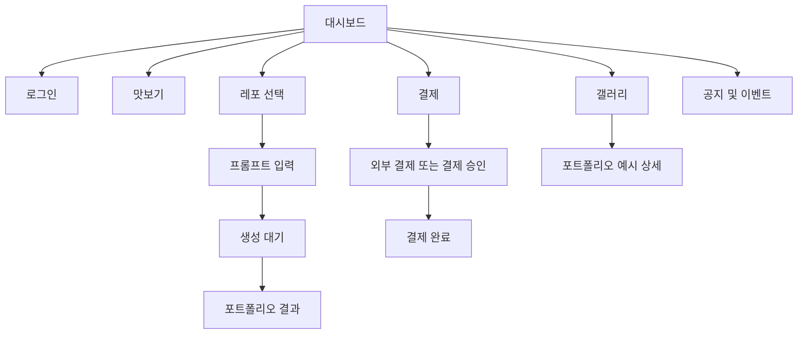
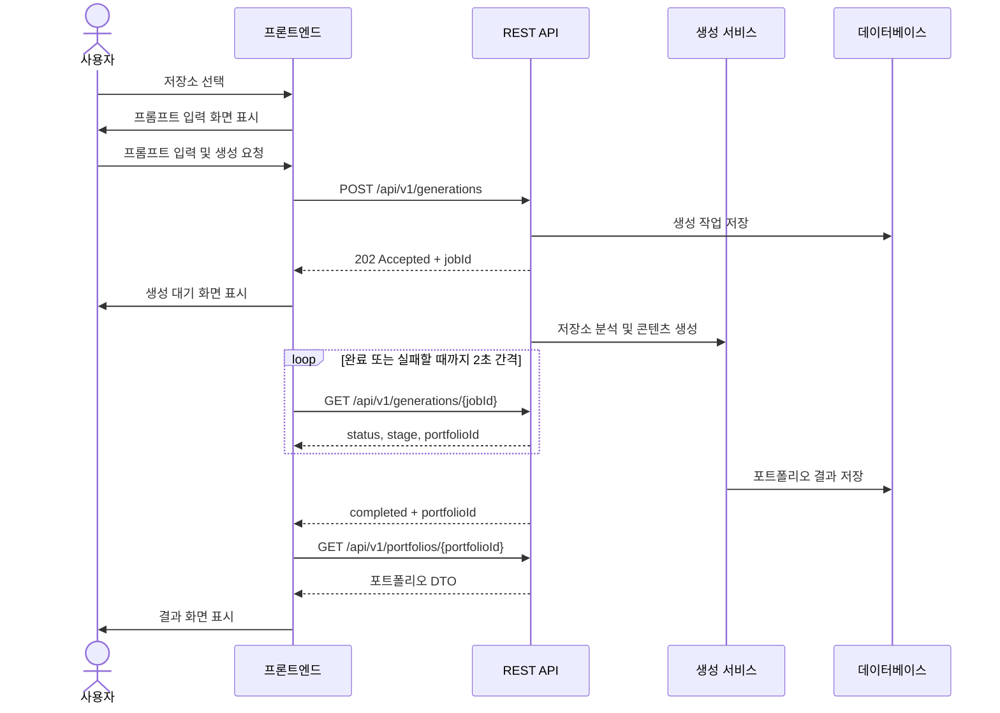
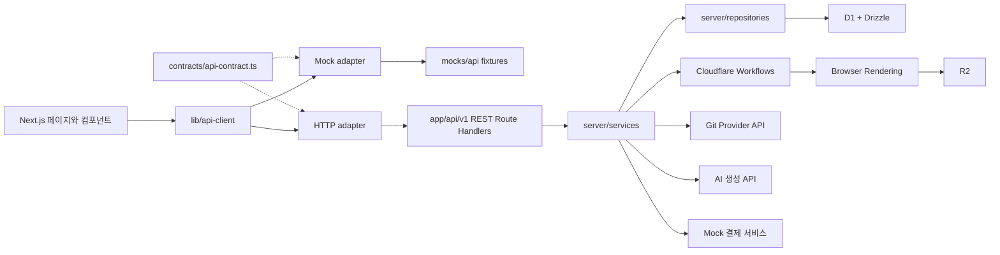

# 취업 포트폴리오 AI 아키텍처

## 1. 문서 목적

이 문서는 취업 포트폴리오 AI MVP의 화면 구조, 사용자 흐름, 프론트엔드·백엔드 경계, REST API와 핵심 데이터 모델을 정의한다. 프론트엔드와 백엔드는 이 문서를 공통 구현 기준으로 사용한다.

## 2. 제품 구조 요약

대시보드를 서비스의 메인 화면으로 사용한다. 사용자는 대시보드에서 로그인하거나 맛보기 기능을 사용하고, 포트폴리오 생성, 결제, 갤러리로 이동한다.



## 3. 기본 제품 결정

- `/dashboard`를 메인 페이지로 사용한다.
- `/` 접근 시 `/dashboard`로 이동한다.
- 대시보드, 맛보기, 갤러리와 공지 조회는 로그인 없이 접근할 수 있다.
- 로그인과 저장소 연동은 GitHub OAuth만 사용한다. MVP에서는 다른 로그인 또는 Git 제공자를 지원하지 않는다.
- 실제 Git 저장소 연결과 포트폴리오 저장은 로그인이 필요하다.
- 대시보드 내부 페이지는 공통 헤더와 내비게이션을 공유한다.
- 포트폴리오 생성은 비동기 작업으로 처리하고 REST API polling으로 상태를 확인한다.
- MVP 결제와 크레딧은 모두 mock으로 구현하며 실제 결제, 크레딧 지급 또는 차감을 수행하지 않는다.
- 신규 사용자의 표시 잔액은 100크레딧이고, 저장소 하나를 사용한 생성의 예상 비용은 30크레딧이다.
- 갤러리는 초기에는 운영자가 준비한 포트폴리오 예시를 노출한다. 사용자 공개 갤러리는 MVP 이후 범위로 둔다.

## 4. 라우트 구조

| 경로 | 접근 | 역할 |
| --- | --- | --- |
| `/` | 공개 | `/dashboard`로 이동 |
| `/dashboard` | 공개 | 메인 대시보드 |
| `/repositories` | 로그인 | 연결된 Git 저장소 선택 |
| `/create/[repositoryId]/prompt` | 로그인 | 선택한 저장소와 생성 프롬프트 입력 |
| `/create/[jobId]/processing` | 로그인 | 생성 진행 상태 확인 |
| `/portfolios/[portfolioId]` | 소유자 | 생성된 포트폴리오 결과 확인 |
| `/billing` | 로그인 | 크레딧 확인과 결제 상품 선택 |
| `/billing/success` | 로그인 | 결제 성공 확인 |
| `/billing/cancel` | 로그인 | 결제 취소 또는 실패 안내 |
| `/gallery` | 공개 | 포트폴리오 예시 그리드 |
| `/gallery/[exampleId]` | 공개 | 포트폴리오 예시 상세 |
| `/announcements/[announcementId]` | 공개 | 공지 또는 이벤트 상세 |

Next.js App Router의 라우트 그룹을 사용해 대시보드 레이아웃을 공유한다.

```text
app/
├── page.tsx
├── layout.tsx
├── (dashboard)/
│   ├── layout.tsx
│   ├── dashboard/page.tsx
│   ├── repositories/page.tsx
│   ├── create/
│   │   ├── [repositoryId]/prompt/page.tsx
│   │   └── [jobId]/processing/page.tsx
│   ├── portfolios/[portfolioId]/page.tsx
│   ├── billing/
│   │   ├── page.tsx
│   │   ├── success/page.tsx
│   │   └── cancel/page.tsx
│   └── gallery/
│       ├── page.tsx
│       └── [exampleId]/page.tsx
├── announcements/[announcementId]/page.tsx
└── api/v1/
```

## 5. 공통 대시보드 레이아웃

대시보드 계열 페이지는 다음 요소를 공유한다.

- 상단 헤더
  - 서비스 로고와 이름
  - 현재 크레딧
  - 로그인 또는 사용자 메뉴
- 내비게이션
  - 대시보드
  - 포트폴리오 만들기
  - 결제
  - 갤러리
- 본문
  - 각 페이지의 주요 콘텐츠
- 전역 피드백
  - 성공·오류 알림
  - 인증 만료 안내

모바일에서는 내비게이션을 접을 수 있는 메뉴 또는 하단 탭으로 제공한다.

## 6. 페이지별 구성

### 6.1 대시보드

대시보드는 사용자가 서비스의 가치를 이해하고 다음 행동을 선택하는 메인 진입점이다.

구성 순서:

1. 로그인 영역
   - 비로그인 사용자는 로그인 CTA를 본다.
   - 로그인 사용자는 이름, 크레딧과 최근 생성 결과를 본다.
2. 진입점
   - 가장 강조된 `포트폴리오 만들기` 버튼
   - 로그인 상태면 `/repositories`로 이동한다.
   - 비로그인 상태면 로그인 후 `/repositories`로 복귀한다.
3. 맛보기
   - 준비된 샘플 저장소와 프롬프트로 생성 과정을 짧게 체험한다.
   - 로그인과 크레딧이 없어도 사용할 수 있다.
   - 결과는 저장하거나 다운로드할 수 없는 미리보기로 제한한다.
4. 공지 및 이벤트
   - 최신 공지와 이벤트를 카드 또는 리스트로 노출한다.
   - 중요도와 게시일을 표시한다.
5. 최근 작업
   - 로그인 사용자에게만 최근 생성 작업과 포트폴리오를 노출한다.

주요 상태:

- 비로그인
- 로그인 완료, 생성 이력 없음
- 로그인 완료, 최근 작업 있음
- 공지 없음
- 데이터 조회 실패

### 6.2 레포 선택

목적은 연결된 Git 저장소 중 포트폴리오 생성에 사용할 저장소 하나를 선택하는 것이다.

구성:

- Git 계정 연결 상태
- 저장소 검색
- 전체·공개·비공개 필터
- 저장소 카드 또는 리스트
  - 저장소 이름
  - 설명
  - 주 언어
  - 최근 업데이트
  - 공개 여부
- 저장소 새로고침
- 빈 상태와 연결 오류 안내

사용자가 저장소 카드를 클릭하면 `/create/[repositoryId]/prompt`로 이동한다.

### 6.3 프롬프트 입력

구성:

- 선택한 저장소 요약
- 사용 목적 또는 지원 직무
- 강조하고 싶은 경험
- 자유 프롬프트 입력란
- 예상 크레딧 사용량
- `포트폴리오 생성` 버튼
- `저장소 다시 선택` 버튼

필수 입력:

- `repositoryId`
- `prompt`

선택 입력:

- `targetRole`
- `tone`
- `highlights`

생성 요청이 성공하면 서버가 `jobId`를 반환하고 `/create/[jobId]/processing`으로 이동한다.

### 6.4 생성 대기

페이지를 새로고침해도 진행 상태를 복구할 수 있도록 URL에 `jobId`를 포함한다.

진행 단계:

1. `queued`: 생성 요청 접수
2. `analyzingRepository`: 저장소 분석
3. `generatingContent`: 포트폴리오 콘텐츠 생성
4. `renderingPortfolio`: 결과 화면 구성
5. `completed`: 생성 완료
6. `failed`: 생성 실패

화면 구성:

- 현재 진행 단계
- 진행 안내 문구
- 단계형 progress UI
- 취소 또는 대시보드 이동
- 실패 시 오류 안내와 재시도 버튼

프론트엔드는 2초 간격으로 생성 상태 API를 호출한다. 완료되면 응답의 `portfolioId`를 사용해 `/portfolios/[portfolioId]`로 이동한다. 연속 오류가 발생하면 polling을 중단하고 재시도 UI를 표시한다.

### 6.5 포트폴리오 결과

구성:

- 생성된 포트폴리오 미리보기
- 프로젝트와 기술 스택
- Git 활동을 기반으로 생성된 주요 성과
- 자기소개 또는 요약
- 사용된 저장소 정보
- 다시 생성
- 저장 또는 다운로드
- 대시보드로 이동

MVP에서는 하나의 고정 스타일을 제공한다. 스타일 선택과 세부 편집은 이후 확장 범위로 둔다.

### 6.6 결제

결제 페이지는 크레딧 잔액과 구매 가능한 상품을 보여준다.

구성:

- 현재 크레딧
- 크레딧 상품 카드
- 상품별 가격과 제공 크레딧
- 선택한 상품 요약
- 결제 버튼
- 최근 결제 내역
- 크레딧 이용 안내

MVP의 결제 버튼은 mock checkout API를 호출하고 `/billing/success`로 이동한다. 응답과 화면에는 `isMock: true`를 명확히 표시하며 실제 승인, 크레딧 지급 또는 잔액 변경은 발생하지 않는다.

신규 사용자의 표시 잔액은 100크레딧이다. 저장소 하나를 사용한 생성의 예상 비용은 30크레딧으로 계산하지만 MVP에서는 실제로 차감하지 않으며 생성 후 잔액도 100으로 유지한다.

### 6.7 갤러리

갤러리는 완성된 포트폴리오 예시를 카드 그리드로 보여준다.

구성:

- 갤러리 제목과 설명
- 직무 또는 기술 스택 필터
- 반응형 그리드
  - 모바일 1열
  - 태블릿 2열
  - 데스크톱 3~4열
- 포트폴리오 카드
  - 썸네일
  - 포트폴리오 제목
  - 직무
  - 주요 기술 태그
  - 스타일 정보
- 더 보기 또는 cursor pagination

카드를 클릭하면 `/gallery/[exampleId]`에서 전체 포트폴리오 예시를 확인한다. 초기 갤러리 데이터는 운영자가 승인한 정적 예시 또는 DB seed 데이터로 구성한다.

## 7. 포트폴리오 생성 흐름



## 8. 시스템 레이어



레이어 규칙:

- UI는 `lib/api-client`의 공통 인터페이스를 통해서만 데이터를 요청한다.
- UI는 `fetch`, mock fixture, HTTP adapter를 직접 사용하지 않는다.
- mock과 HTTP adapter는 모두 `contracts/api-contract.ts`의 동일 DTO를 반환한다.
- Route Handler는 요청 파싱, 인증 확인과 HTTP 응답 변환을 담당한다.
- 비즈니스 로직은 `server/services/**`에 둔다.
- DB 쿼리는 `server/repositories/**` 또는 `db/**`로 제한한다.
- 외부 Git과 AI 제공자 코드는 adapter로 분리한다. 실제 결제를 연결할 때도 동일한 adapter 경계를 사용한다.
- 외부 서비스의 응답 타입을 UI나 DB 모델로 직접 사용하지 않는다.

### 8.2 백엔드 실행 구조

MVP 백엔드는 Cloudflare Workers와 D1을 기준으로 구현한다. 장시간 실행되는
저장소 분석과 AI 생성은 HTTP 요청 안에서 처리하지 않고 Cloudflare Workflow로
실행한다.

| 구성 요소 | 책임 |
| --- | --- |
| Cloudflare Workers | REST Route Handler, 세션 검증, 입력 검증과 응답 변환 |
| D1 + Drizzle | 사용자, Git 연결, 저장소 메타데이터, 생성 작업과 결과 저장 |
| Cloudflare Workflows | 분석, 콘텐츠 생성, 웹 렌더링, PDF 렌더링 단계 실행과 재시도 |
| Cloudflare R2 | 생성된 PDF 이력서와 향후 사용자 업로드 문서의 비공개 저장 |
| Cloudflare Browser Rendering | 완성된 포트폴리오 HTML을 PDF 이력서로 렌더링 |

생성 흐름은 다음 순서를 따른다.

1. `POST /api/v1/generations`가 D1에 `queued` 작업을 만들고 Workflow를 시작한다.
2. Workflow가 D1의 단계와 진행률을 갱신하며 GitHub 데이터를 분석한다.
3. AI 생성 결과를 구조화된 포트폴리오 콘텐츠로 저장한다.
4. 포트폴리오 HTML을 렌더링하고 Browser Rendering으로 PDF를 생성한다.
5. PDF를 R2의 비공개 객체로 저장한 뒤 작업을 `completed`로, 결과를 조회 가능 상태로 갱신한다.

재시도는 실패한 작업에 새 Workflow와 새 `GenerationJob`을 만들며, 기존 작업의
결과를 덮어쓰지 않는다. 프론트엔드는 기존 polling 계약으로 D1에 저장된 상태를
조회한다.

GitHub OAuth callback은 access token을 API 응답이나 로그에 포함하지 않는다.
`GitConnection`에는 암호화된 token, 암호화 초기화 벡터, 권한 범위와 연결 시각을
서버 전용으로 저장한다. 암호화 키는 Worker secret으로만 제공하고 `NEXT_PUBLIC_`
환경변수나 클라이언트 모듈에 두지 않는다.

PDF 원본은 R2 public bucket에 두지 않는다. 소유자 요청을 검증하는
`GET /api/v1/portfolios/{portfolioId}/resume.pdf` Route Handler만 PDF를 반환한다.
이 URL은 `PortfolioDto.resumePdf.downloadUrl`로 제공한다.

### 8.1 프론트엔드 Mock 우선 구조

백엔드 API가 개발 중인 동안 프론트엔드는 사전 정의된 계약에 맞춘 mock adapter를 사용한다.

```text
contracts/
└── api-contract.ts             공유 DTO와 endpoint

lib/api-client/
├── index.ts                    UI에 노출되는 단일 진입점
├── client.ts                   공통 API client 인터페이스
└── adapters/
    ├── mock/                   개발 중 기본 adapter
    └── http/                   백엔드 통합 후 사용하는 REST adapter

mocks/api/
├── fixtures/                   계약 타입을 만족하는 데이터
└── scenarios/                  성공, 빈 상태, 처리 중, 실패 시나리오
```

구현 규칙:

- mock fixture는 `contracts/api-contract.ts` 타입과 `satisfies`를 사용해 컴파일 단계에서 스키마를 검증한다.
- `lib/api-client/index.ts`가 설정에 따라 mock 또는 HTTP adapter를 선택한다.
- 페이지와 컴포넌트는 adapter 종류를 알지 못해야 한다.
- 기본 개발 모드는 `mock`이다.
- 백엔드가 계약 준수 검증을 통과한 뒤 adapter 설정만 `http`로 전환한다.
- HTTP 전환을 위해 페이지, 컴포넌트 또는 화면 상태 타입을 수정하지 않는다.
- mock은 성공 응답뿐 아니라 빈 목록, 인증 필요, 생성 진행, 생성 실패와 재시도 상태를 제공한다.

## 9. REST API 초안

모든 응답은 `AGENTS.md`에 정의된 성공·실패 envelope를 따른다.

### 인증, 사용자와 대시보드

| Method | Endpoint | 설명 |
| --- | --- | --- |
| `GET` | `/api/v1/auth/github` | GitHub OAuth 로그인 시작. GitHub로 redirect |
| `GET` | `/api/v1/auth/github/callback` | GitHub OAuth callback 처리 |
| `GET` | `/api/v1/auth/session` | 현재 로그인 세션 조회 |
| `POST` | `/api/v1/auth/logout` | 세션 종료 |
| `GET` | `/api/v1/dashboard` | 대시보드 통합 데이터 조회 |

### 저장소

| Method | Endpoint | 설명 |
| --- | --- | --- |
| `GET` | `/api/v1/repositories` | 연결된 Git 저장소 목록 조회 |
| `POST` | `/api/v1/repositories/sync` | 저장소 목록 새로고침 |
| `GET` | `/api/v1/repositories/{repositoryId}` | 저장소 요약 조회 |

### 생성 작업과 포트폴리오

| Method | Endpoint | 설명 |
| --- | --- | --- |
| `POST` | `/api/v1/generations` | 포트폴리오 생성 작업 시작 |
| `GET` | `/api/v1/generations/{jobId}` | 생성 상태 조회 |
| `POST` | `/api/v1/generations/{jobId}/retry` | 실패한 생성 재시도 |
| `GET` | `/api/v1/portfolios` | 사용자의 포트폴리오 목록 |
| `GET` | `/api/v1/portfolios/{portfolioId}` | 포트폴리오 결과 조회 |

생성 요청 예시:

```json
{
  "repositoryId": "repo_123",
  "prompt": "백엔드 직무에 맞춰 문제 해결 과정과 성능 개선 경험을 강조해줘.",
  "targetRole": "Backend Engineer",
  "tone": "professional",
  "highlights": ["API 설계", "성능 개선"]
}
```

생성 접수 응답 예시:

```json
{
  "data": {
    "jobId": "job_123",
    "status": "queued",
    "stage": "queued"
  }
}
```

생성 상태 응답 예시:

```json
{
  "data": {
    "jobId": "job_123",
    "status": "completed",
    "stage": "completed",
    "portfolioId": "portfolio_123"
  }
}
```

### 결제와 크레딧

| Method | Endpoint | 설명 |
| --- | --- | --- |
| `GET` | `/api/v1/credits` | 현재 크레딧과 최근 내역 조회 |
| `GET` | `/api/v1/billing/products` | 구매 가능한 크레딧 상품 조회 |
| `POST` | `/api/v1/billing/checkout` | mock checkout 결과 생성. 잔액은 변경하지 않음 |
| `GET` | `/api/v1/billing/payments` | mock 결제 내역 조회 |

### 갤러리와 공지

| Method | Endpoint | 설명 |
| --- | --- | --- |
| `GET` | `/api/v1/taste/sample` | 로그인 없는 정적 맛보기 데이터 조회 |
| `GET` | `/api/v1/gallery` | 공개 포트폴리오 예시 목록 |
| `GET` | `/api/v1/gallery/{exampleId}` | 예시 상세 조회 |
| `GET` | `/api/v1/announcements` | 공지와 이벤트 목록 |
| `GET` | `/api/v1/announcements/{announcementId}` | 공지 상세 조회 |

## 10. 핵심 데이터 모델

| 모델 | 주요 필드 | 설명 |
| --- | --- | --- |
| `User` | `id`, `email`, `name`, `creditBalance`, `createdAt` | 사용자와 크레딧 잔액 |
| `GitConnection` | `id`, `userId`, `provider`, `providerUserId` | Git 계정 연결 정보 |
| `Repository` | `id`, `userId`, `providerRepoId`, `name`, `url`, `language`, `isPrivate`, `updatedAt` | 동기화된 저장소 |
| `GenerationJob` | `id`, `userId`, `repositoryId`, `prompt`, `status`, `stage`, `errorCode`, `portfolioId`, `createdAt` | 비동기 생성 작업 |
| `Portfolio` | `id`, `userId`, `repositoryId`, `title`, `content`, `style`, `resumePdfKey`, `resumePdfGeneratedAt`, `createdAt` | 생성 결과와 PDF 위치 |
| `GalleryExample` | `id`, `title`, `role`, `techStack`, `thumbnailUrl`, `portfolioContent`, `isPublished` | 공개 예시 |
| `CreditLedger` | `id`, `userId`, `amount`, `reason`, `referenceId`, `createdAt` | 실제 크레딧 도입 시 사용할 증감 원장. MVP에서는 저장하지 않음 |
| `Payment` | `id`, `userId`, `provider`, `providerPaymentId`, `amount`, `credits`, `status`, `createdAt` | 실제 결제 도입 시 사용할 결제 기록. MVP에서는 저장하지 않음 |
| `Announcement` | `id`, `title`, `content`, `type`, `publishedAt`, `endsAt` | 공지와 이벤트 |

MVP에서는 크레딧과 결제 데이터를 영구 저장하지 않는다. 실제 결제를 도입하는 단계에서는 크레딧 잔액만 수정하지 않고 `CreditLedger`에 모든 증감 기록을 남기며, 결제 webhook과 생성 차감 요청은 idempotency key로 중복 처리를 방지한다.

## 11. 주요 UI 컴포넌트

```text
components/
├── layout/
│   ├── DashboardShell.tsx
│   ├── DashboardHeader.tsx
│   └── DashboardNavigation.tsx
├── dashboard/
│   ├── LoginCard.tsx
│   ├── QuickStartCard.tsx
│   ├── TastePreview.tsx
│   ├── RecentWorkList.tsx
│   └── AnnouncementList.tsx
├── repositories/
│   ├── RepositoryCard.tsx
│   ├── RepositoryFilters.tsx
│   └── RepositoryEmptyState.tsx
├── generation/
│   ├── PromptForm.tsx
│   ├── GenerationProgress.tsx
│   └── GenerationError.tsx
├── portfolio/
│   └── PortfolioPreview.tsx
├── billing/
│   ├── CreditBalance.tsx
│   ├── CreditProductCard.tsx
│   └── PaymentHistory.tsx
└── gallery/
    ├── GalleryGrid.tsx
    ├── GalleryCard.tsx
    └── GalleryFilters.tsx
```

## 12. 오류와 예외 처리

- 인증이 필요한 페이지에 비로그인 사용자가 접근하면 로그인 후 원래 경로로 복귀한다.
- Git 연결이 없으면 저장소 선택 대신 연결 CTA를 표시한다.
- 저장소가 비어 있으면 검색 결과 없음과 계정에 저장소가 없음 상태를 구분한다.
- MVP에서는 크레딧 부족으로 생성을 차단하지 않는다. 예상 비용 30과 `willCharge: false`를 표시한다.
- 생성 상태 조회가 일시적으로 실패하면 제한된 횟수만 재시도한다.
- 생성 실패 시에도 mock 크레딧 잔액은 변하지 않는다.
- mock 결제 성공 화면에서도 크레딧을 실제로 지급하지 않는다.
- 외부 서비스 오류에는 내부 오류 원문이나 비밀 정보를 노출하지 않는다.

## 13. MVP 구현 우선순위

### P0

- 공통 대시보드 레이아웃과 내비게이션
- 대시보드의 로그인, 맛보기, 진입점, 공지·이벤트 영역
- 저장소 선택 화면
- 프롬프트 입력 화면
- 생성 대기와 polling
- GitHub OAuth와 수동 저장소 동기화
- GitHub 로그 기반 분석과 AI 콘텐츠 생성
- 포트폴리오 결과 화면과 PDF 이력서 다운로드
- 결제 상품 화면과 checkout 진입
- 신규 사용자 100크레딧과 생성 예상 비용 30의 mock 표시
- 갤러리 그리드와 상세 화면
- 주요 REST API 계약

### P1

- 최근 작업과 생성 재시도

### P2

- 문서 업로드
- 다중 포트폴리오 스타일
- 포트폴리오 세부 편집
- 사용자 공개 갤러리
- 고급 검색과 필터
- 실제 결제 제공자와 webhook 연결
- 실제 크레딧 차감과 원장

## 14. 확정이 필요한 항목

다음 항목은 구현 전에 제품 결정이 필요하지만, 현재 화면 골격 구현을 막지는 않는다.

1. 맛보기에서 실제 AI를 호출할지, 준비된 결과를 보여줄지 여부
2. 실제 결제 도입 시 사용할 결제 제공자와 상품 가격
3. 실제 크레딧 차감 도입 시 생성 실패 환불 정책

MVP는 GitHub OAuth 단일 로그인, 기본 표시 잔액 100, 저장소당 예상 비용 30, 실제 차감 없는 mock 결제, 하나의 포트폴리오 스타일, 웹 미리보기와 PDF 이력서를 기본값으로 사용한다.
