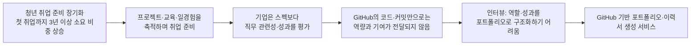
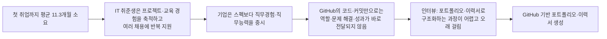

# 취업준비생 포트폴리오 시장자료 조사

> 지금 해커톤에서 취업준비생들이 포트폴리오 작성할 때 도움 받을 수 있는 서비스를 만드려고 해. 특히 깃허브랑 연동이 좋은 포트폴리오 제작을 서비스 목표로 할거야.
>
> 그래서 우선 문제정의를 하려고. 구직자 수가 증가 중이다와 같이 시장흐름을 알 수 있는 자료들을 찾아줘

<details><summary>2 previous messages</summary>

> 해커톤의 문제정의에 바로 쓸 수 있도록, 취업 경쟁·포트폴리오 요구·GitHub 활용 흐름을 뒷받침하는 최신 공신력 자료를 찾아 핵심 수치와 인용 문장 형태로 정리하겠습니다.
>
> <details><summary>Searched the web</summary>
>
> Searched the web for `site:kostat.go.kr 2026 청년 고용동향 청년 실업률 구직자 수 ...`
>
> Searched the web for `2025년 청년층 부가조사 취업준비자 수 2024년 통계청 ...`
>
> Searched the web for `GitHub Octoverse 2025 developer portfolio hiring open source statistics official ...`
>
> </details>
</details>

> 해당 서비스는
> - 제작 : 포트폴리오 (+ 이력서)
> - 필요한 것
>     - Git Repo
>     - 사용자 지침
>         - 프롬프트
>         - (+문서)
> - 스타일 1개 (+다중 스타일)
> - 요금 : 크레딧 체계
>     - 기본 100 크레딧
> - 레포당 30 크레딧 추가
>
> 이정도를 참고하면 돼.

<details><summary>2 previous messages</summary>

> 서비스 범위를 반영해 문제정의를 “GitHub에는 작업 증거가 있지만, 이를 채용자가 빠르게 이해하는 포트폴리오·이력서로 변환하기 어렵다”에 맞추겠습니다. 특히 레포 분석, 사용자 지침, 스타일 생성, 크레딧 과금이 자연스럽게 이어지도록 근거를 선별하겠습니다.
>
> <details><summary>Searched the web</summary>
>
> Searched the web for `site:github.blog/news-insights/octoverse Octoverse 2025 report developers repositories ...`
>
> </details>
</details>

“구직자 수가 증가 중”보다는 아래처럼 정의하는 편이 통계적으로 정확하고, 서비스와도 더 잘 연결됩니다.

> 청년 인구는 줄고 있지만, 채용은 수시·직무역량 중심으로 바뀌고 있다.
> 취업준비생은 GitHub에 쌓인 프로젝트 경험을 보유해도, 이를 채용자가 짧은 시간 안에 이해할 수 있는 포트폴리오와 이력서로 구조화하는 데 어려움을 겪는다.

| 시장 흐름 | 근거 | 서비스 기회 |
|---|---|---|
| 청년 채용 경쟁과 취업 준비의 장기화 | 2025년 5월 기준 청년층 평균 취업 소요기간은 **11.3개월**. 청년층 비경제활동인구 중 취업시험 준비 비율은 **14.5%**, 전년 대비 0.6%p 증가. | 반복 수정·보완하는 포트폴리오 제작 수요 |
| 채용은 ‘스펙’보다 직무 전문성·실무 증거를 봄 | 기업 396곳 중 **52.8%**가 청년 채용 시 전문성을 우선 요구. 전문성 평가 항목으로 일경험 19.1%, 직무 교육·훈련 17.4%를 중시. | GitHub 프로젝트를 역량 증거로 번역할 필요 |
| 신입에게도 즉시 업무 가능한 역량 요구 | 고용노동부는 수시·경력직 중심 채용 경향이 심화되고 있다고 분석. | 레포의 코드·기술스택·기여도를 채용 언어로 요약 |
| AI 기반 채용·작성 도구가 일반화 | 조사 기업의 **86.7%**가 인사 업무에 AI 도구를 사용하고, 청년 재직자의 56.2%는 AI가 업무 속도 향상에 도움 된다고 응답. | AI가 사용자의 지침을 반영해 맞춤형 결과물을 만드는 UX 설득 가능 |
| GitHub 자체가 빠르게 확장 | GitHub의 2025 Octoverse는 “매초 새 개발자가 GitHub에 가입”한다고 보고. | 이미 축적된 GitHub 데이터를 포트폴리오 자산으로 전환 |

근거 자료: [통계청 2025년 5월 청년층 부가조사](https://sri.kostat.go.kr/boardDownload.es?bid=210&list_no=437676&seq=9), [고용노동부 2025년 기업 채용동향조사](https://www.moel.go.kr/news/enews/report/enewsView.do?news_seq=18595), [고용노동부 AI 채용동향조사](https://www.moel.go.kr/news/enews/report/enewsView.do?news_seq=18662), [GitHub Octoverse](https://github.blog/octoverse/).

해커톤 발표용 문제정의 문안은 이렇게 쓸 수 있습니다.

> 취업준비생은 GitHub에 프로젝트 결과물을 축적하지만, 레포지토리의 코드·커밋·문서를 직무 역량이 드러나는 포트폴리오와 이력서로 재구성하기 위해 많은 시간과 글쓰기 역량이 필요하다.
> 특히 직무 전문성과 실무 경험을 중시하는 채용 환경에서, “무엇을 만들었는가”는 있어도 “어떤 문제를 어떻게 해결했고 나의 기여가 무엇인가”가 명확히 전달되지 않는 문제가 발생한다.

서비스 연결도 명확합니다.

- Git Repo 연결: 코드·README·기술스택을 작업 증거로 수집
- 프롬프트·문서 입력: 사용자의 실제 역할, 문제 상황, 성과를 보완
- 포트폴리오 + 이력서 동시 생성: 같은 경험을 채용 문서별 문법으로 변환
- 스타일 선택: 개발자 개인 브랜딩과 지원 직무에 맞춘 결과물
- 크레딧: 기본 100 크레딧 제공, 레포 추가 분석·생성 시 레포당 30 크레딧 차감

중요하게, 발표에서 “청년 구직자 수가 증가한다”고 단정하는 것은 피하는 게 좋습니다. 청년 인구와 청년 취업자 수는 감소 추세이기 때문입니다. 대신 **“청년 취업의 난이도와 직무역량 증명 부담이 커지고 있다”**로 잡으면 데이터와 제품이 일관됩니다.

> 아니면 취업준비생들 중 포트폴리오에 깃허브 내용이 들어가야하는 it분야의 청년 취업자 수 감소 추세를 보여주는 통계자료가 있어?

<details><summary>2 previous messages</summary>

> 있습니다. 다만 “IT 취업준비생 수”를 직접 집계한 공식 통계는 드물고, 가장 방어력 있는 지표는 **청년(15~29세) 정보통신업 취업자 수** 또는 **청년 소프트웨어 개발직 취업자 수**입니다. 두 지표 중 연도별 비교가 가능한 공식 자료를 확인하겠습니다.
>
> <details><summary>Searched the web</summary>
>
> Searched the web for `site:kostat.go.kr 청년층 정보통신업 취업자 수 2025 15~29세 ...`
>
> Searched the web for `"청년층" "정보통신업" "취업자" "전년동월대비" 2025 ...`
>
> </details>
</details>

결론부터 말하면, **“IT 분야 청년 취업자 수가 감소 추세”라고 말할 만한 공식 통계는 현재 찾기 어렵습니다.** 오히려 확인 가능한 장기 수치는 반대 방향입니다.

- 통계청 원자료를 인용한 국회 자료에서, **15~29세 정보통신업 취업자 수는 2014년 상반기 16.6만 명 → 2019년 17.5만 명 → 2024년 상반기 23.9만 명**으로 증가했습니다. [국회 정책자료](https://clik.nanet.go.kr/clikr-collection/policyinfo/2/8/2025/CLIKC5272559667068323_attach_1.pdf)
- 2024년 청년층 부가조사도 졸업 청년 취업자 가운데 정보통신업 취업자 수가 전년보다 증가했다고 설명합니다. [통계청 청년층 부가조사 브리핑](https://www.korea.kr/briefing/policyBriefingView.do?newsId=156641240)
- 정보통신업 전체 취업자도 2025년에는 증가 흐름으로 집계됐습니다. [통계청 2025년 고용동향](https://mods.go.kr/boardDownload.es?bid=210&list_no=434801&seq=1)

그래서 발표에서 이 주장을 쓰면 반박받을 수 있어요.

대신 아래 두 문장을 조합하는 것이 정확합니다.

> 전체 청년 취업자는 감소하고 있다. 2025년 5월 청년 취업자는 368.2만 명으로 전년보다 15만 명 감소했으며, 청년 고용률도 0.7%p 하락했다. [통계청 2025년 청년층 부가조사](https://sri.kostat.go.kr/boardDownload.es?bid=210&list_no=437676&seq=9)

> 반면 정보통신업은 청년 취업 비중이 높은 산업이다. 수도권 청년 취업자 중 정보통신업 비중은 13.9%로 가장 높다. [통계청 지역별 생애단계 고용 분석](https://sri.kostat.go.kr/boardDownload.es?bid=11802&list_no=437778&seq=3)

이를 서비스 문제로 연결하면:

> 청년 전체의 취업 기회는 줄어드는 가운데, IT 취업준비생은 GitHub에 축적한 프로젝트 경험을 단순 코드 저장소가 아닌 ‘직무 역량을 증명하는 포트폴리오와 이력서’로 전환해야 한다. 그러나 레포별 기여도와 기술적 의사결정을 채용 언어로 구조화하는 데 높은 시간·글쓰기 장벽이 존재한다.

즉, 핵심은 “IT 취업자가 감소한다”보다 **“청년 취업시장은 위축되지만, IT에서는 프로젝트 경험을 보여주는 방식의 경쟁력이 중요하다”**입니다.

> 정보통신업 신입 채용관련한 자료는?

<details><summary>2 previous messages</summary>

> 정보통신업 전체 고용과 달리, **신입 채용 규모·신입 선호도**를 직접 보여 주는 자료를 중심으로 확인하겠습니다. 산업별 신규채용 통계와 기업 채용조사를 구분해 보겠습니다.
>
> <details><summary>Searched the web</summary>
>
> Searched the web for `정보통신업 신입 채용 감소 통계 2025 고용노동부 ...`
>
> </details>
</details>

있습니다. 다만 **정보통신업만 분리한 ‘최신 신입 채용 인원’ 통계**는 공개 자료가 제한적입니다. 발표에 쓸 만한 자료는 아래 조합이 가장 좋습니다.

1. 정보통신업에서 신입채용 비중이 줄고, 경력채용이 늘어나는 흐름

한국고용정보원이 정보통신업을 청년 취업 대표 업종으로 두고 기업 공고·인사담당자 인터뷰를 분석한 결과, **신입채용 비중은 지속적으로 낮아지고 경력채용은 증가**한다고 결론냈습니다. 정기공채도 줄고 수시채용이 늘어나는 흐름입니다. 다만 보고서 발간은 2017년이라, “장기 구조 변화”를 보여 주는 보조 근거로 쓰는 것이 안전합니다. [한국고용정보원 연구보고서](https://www.keis.or.kr/keis/ko/proj/113/pblc/detail.do?categoryIdx=131&pubIdx=3501)

2. 최신 채용시장의 신입 선발 기준: 프로젝트 경험·성과가 핵심

고용노동부·한국고용정보원의 2023년 하반기 500대 기업 조사에서 기업은 향후 **수시채용 확대 81.6%, 경력직 채용 확대 70.8%**를 예상했습니다. 신규채용의 최우선 결정요소는 **직무 관련 일경험 35.6%**였고, 기업이 유효하다고 본 경험 방식에는 **기업 프로젝트 참여 및 성과 제출 68.9%**가 포함됩니다. 즉, GitHub 프로젝트를 잘 설명하는 포트폴리오가 필요한 근거로 매우 직접적입니다. [조사 결과](https://www.keis.or.kr/keis/ko/bbs/225/detail.do?pageIndex=1&pstSn=62713)

3. IT·SW 분야는 인력 부족이 있으나 ‘신입이 쉽게 채용된다’는 뜻은 아님

산업통상부의 2025년 산업기술인력 수급실태조사(2024년 말 기준)는 **소프트웨어 인력 부족을 6,561명**으로 집계했습니다. 동시에 기업은 채용에서 직무 증명과 경험을 요구하므로, 수요가 있어도 취업준비생은 자신의 프로젝트를 채용 가능한 방식으로 입증해야 하는 미스매치가 존재한다고 해석할 수 있습니다. [산업통상부 조사](https://www.motir.go.kr/kor/article/ATCL3f49a5a8c/171402/view?displayAuthor=&endDtD=&mno=&pageIndex=7&rowPageC=0&schClear=on&searchCategory=0&searchCondition=1&searchKeyword=&startDtD=)

발표용으로는 이 문장이 좋습니다.

> IT·SW 산업은 인력 수요가 존재하지만, 채용은 신입 공채보다 수시·경력직 중심으로 재편되고 있다. 기업은 신규채용에서도 직무 관련 일경험과 프로젝트 성과를 중시한다. 따라서 취업준비생에게는 GitHub의 레포지토리를 단순 링크가 아니라, 본인의 역할·기술적 선택·문제 해결 성과가 드러나는 포트폴리오와 이력서로 전환하는 도구가 필요하다.

“정보통신업 신입 채용 수가 감소했다”라는 수치 주장보다는, **“신입 비중 하락 + 프로젝트 증명 요구 강화”**로 문제를 잡는 편이 근거가 탄탄합니다.

> 서브에이전트 만들어서 '한국 청년의 첫 취업까지 기간 (취업 준비 기간이 길어져 포트폴리오를 만들고 다듬을 필요가 커짐)', 'Big Tech 신입은 전체 채용의 7%; 신입 채용은 2019년 대비 50% 이상 감소', '채용은 ‘스펙’보다 직무 전문성·실무 증거를  봄'에 대해서 더 자세하게 조사해줘. 조사할 때 조사한 자료의 정확한 위치(몇 페이지 몇번째 줄)까지 같이 알려줘.

<details><summary>4 previous messages</summary>

> 세 갈래로 나눠 공식 원문·조사 보고서를 확인하겠습니다. 각 자료는 인용 가능한 문장, 발행일, 그리고 PDF라면 페이지·본문 줄 위치까지 검증해 받겠습니다.
>
> 병렬 조사 중입니다. 특히 두 번째 수치는 해외 리포트에서 자주 축약 인용되므로, 원문 맥락과 “Big Tech” 정의까지 대조해 정확성을 먼저 확인하겠습니다.
>
> 원문 위치 표기를 통일하기 위해 PDF는 `쪽수 + 문단/표 제목 + 추출 텍스트 줄` 형식으로 정리하고 있습니다. 웹페이지 자료는 페이지 내 문단 번호 또는 본문 줄 위치로 대체합니다.
>
> 첫 두 축은 원문 수치와 표 위치를 교차 확인했습니다. 핵심 정정도 하나 있습니다. 첫 취업 평균 기간은 장기적으로는 늘었지만 2025년만 보면 전년보다 0.2개월 짧아져, ‘지속 증가’ 대신 ‘장기 취업준비층 확대’로 표현해야 정확합니다.
</details>

조사 결과입니다. 우선 두 가지 표현은 정정하는 편이 정확합니다.

- “첫 취업까지 기간이 계속 길어진다” → **장기적으로는 늘었지만, 2025년 평균은 전년보다 소폭 감소**했습니다.
- “Big Tech 신입은 전체 채용의 7%” → **Big Tech의 ‘신규 채용’ 중 신입 비중이 7%**라는 뜻입니다.

## 1) 한국 청년의 첫 취업까지 기간

가장 신뢰도 높은 자료는 통계청 「2025년 5월 경제활동인구조사 청년층 부가조사 결과」입니다.
[원문 PDF, 40쪽](https://kostat.go.kr/boardDownload.es?bid=210&list_no=437676&seq=9)

| 확인 내용 | 수치 | 정확한 위치 |
|---|---:|---|
| 첫 취업 평균 소요기간 | 2025년 **11.3개월**, 전년 대비 **-0.2개월** | PDF 6쪽 / 인쇄 쪽수 3쪽 / 본문 추출 L146–147 |
| 첫 취업까지 3년 이상 소요 비중 | 2023년 8.4% → 2024년 9.7% → 2025년 **9.9%** | PDF 19쪽 / 인쇄 16쪽 / `<첫 취업 소요기간>` 표, L685–690 |
| 평균 기간의 장기 추세 | 2016년 10.2개월 → 2025년 **11.3개월** | PDF 36쪽 / 인쇄 33쪽 / 시계열 표, L1713–1714 |
| 미취업 청년의 주된 활동 중 직업교육·취업시험 준비 | 2024년 37.8%(48.7만 명) → 2025년 **40.5%(49.1만 명)** | PDF 18쪽 / 인쇄 15쪽 / `<미취업자의 주된 활동>` 표, L673–682 |
| 비경제활동 청년 중 취업시험 준비자 비율 | **14.5%**, 전년 대비 +0.6%p | PDF 6쪽 / 인쇄 3쪽 / L155–158 |

비교용 전년도 원문도 있습니다. [통계청 2024년 청년층 부가조사 PDF](https://kostat.go.kr/boardDownload.es?bid=210&list_no=431803&seq=3)의 PDF 19쪽·인쇄 16쪽·L686–724에서, 평균 소요기간이 2023년 10.4개월에서 2024년 11.5개월로 늘어난 점과 3년 이상 소요 비중 상승을 확인할 수 있습니다.

발표용 문장:

> 첫 취업 평균 소요기간은 2025년 11.3개월이다. 평균은 전년보다 0.2개월 줄었지만, 첫 취업까지 3년 이상 걸린 청년 비중은 2023년 8.4%에서 2025년 9.9%로 상승했다. 취업 준비 기간 동안 프로젝트 경험을 체계적으로 정리하고 지속적으로 개선할 필요가 커지고 있다.

## 2) Big Tech 신입 채용 축소

원 출처는 SignalFire의 2025년 민간 데이터 분석입니다. 한국 공식 통계가 아니라 **미국의 시가총액 상위 15개 기술기업**을 대상으로 한 LinkedIn·자체 데이터 기반 분석이라는 한계를 밝혀야 합니다.
[SignalFire State of Tech Talent Report 2025](https://www.signalfire.com/blog/signalfire-state-of-talent-report-2025)

| 확인 내용 | 수치 | 정확한 위치 |
|---|---:|---|
| Big Tech 신규채용 중 신입 비중 | **7%** | 웹 본문 L31 |
| 신입 신규채용 감소 | 2023년 대비 **-25%**, 2019년 대비 **-50% 이상** | 웹 본문 L31 |
| 보고서의 핵심 제목 | “New grad hiring drops 50% compared to pre-pandemic levels” | 웹 본문 L26 |
| Big Tech 정의 | 시가총액 기준 상위 **15개** 기술기업 | 방법론 L117–127, 정의 L122 |
| 데이터 범위 | Beacon AI가 6.5억 명 이상 개인·8천만 조직 추적 | 방법론 L119 |
| 원인 해석 유의 | AI만이 아니라 긴축, 과잉채용 조정 등 복합 요인 | L50–56 |

독립 보도에서도 팬데믹 전 Big Tech 신입 비중이 약 15%에서 7%로 낮아졌다고 SignalFire를 인용합니다. [TechCrunch 기사](https://techcrunch.com/2025/05/26/why-landing-your-first-tech-job-is-way-harder-than-you-expected/) 본문 L110, L112–115.

발표용 문장:

> 미국의 시가총액 상위 15개 기술기업을 분석한 SignalFire에 따르면, 2024년 신규채용 중 신입 비중은 7%였고 신입 채용 규모는 2019년 대비 50% 이상 감소했다. 신입에게는 학력·자격보다 실제 프로젝트 경험을 설득력 있게 증명하는 포트폴리오의 중요성이 커지고 있다.

## 3) 채용은 스펙보다 직무 전문성·실무 증거를 본다

### 최신 공식 자료: 2025년 기업 채용동향조사

[고용노동부·한국고용정보원 2025년 기업 채용동향조사](https://www.moel.go.kr/news/enews/report/enewsView.do?news_seq=18595)

- 조사 대상: 기업 396개, 웹 본문 L574
- 청년 채용에서 전문성을 우선 요구: **52.8%**, L577–580
- 전문성 평가 시 주요 항목: 전공 22.3%, 인턴 등 일경험 **19.1%**, 직무 관련 교육·훈련 17.4%, L578
- 지원자의 일경험이 입사 후 적응에 도움이 된다고 본 기업: **85.4%**
- 일경험 평가 기준: 채용 직무와의 관련성 **84.0%**, 일경험 성과 43.9%, 경험 유무 39.5%, L577–580
- 구직자 교육·훈련 프로그램을 운영하는 기업 중 정보통신업 비중: **50.0%**, 해당 프로그램 이수자에게 채용 혜택을 주는 기업: **83.3%**, L587–588

### 보강 자료: 2023년 하반기 기업 채용동향조사

[고용노동부·한국고용정보원 조사](https://www.keis.or.kr/keis/ko/bbs/225/detail.do?pageIndex=1&pstSn=62713)

- 대상: 매출액 상위 500대 기업 인사담당자, 315개 응답, 웹 L38–39
- 스펙(학교·전공·학점)을 중요하다고 본 비율: **36.2%**
- 직무경험·경력 등 직무능력을 중요하다고 본 비율: **96.2%**, L41
- 신규채용 결정요소 1위: 직무 관련 일경험 **35.6%**, 2위 일반직무역량 27.3%, L43
- 효과적인 일경험 방식: 장기 인턴십 74.0%, **기업 프로젝트 참여·성과 제출 68.9%**, L44
- 수시채용 확대를 예상한 기업: 81.6%, 경력직 채용 확대: 70.8%, L41

발표용 문장:

> 기업은 청년 채용에서 전문성과 실무 증거를 중시한다. 2025년 기업 채용동향조사에서 응답 기업의 52.8%가 전문성을 우선 요구했고, 일경험은 전문성 평가의 핵심 항목이었다. 특히 기업은 일경험의 직무 관련성과 성과를 평가한다. GitHub 레포지토리에 남아 있는 코드와 프로젝트 문서를 포트폴리오·이력서의 ‘직무 증거’로 변환할 필요가 있다.

참고로 ‘L’은 원문 PDF 또는 웹페이지를 텍스트로 추출했을 때의 줄 번호입니다. PDF 자료는 발표 자료 각주에 **문서명 + PDF 쪽수 + 표 제목**까지 함께 적으면 검증하기 좋습니다.

> '기업은 청년 채용에서 전문성과 실무 증거를 중시한다. 2025년 기업 채용동향조사에서 응답 기업의 52.8%가 전문성을 우선 요구했고, 일경험은 전문성 평가의 핵심 항목이었다. 특히 기업은 일경험의 직무 관련성과 성과를 평가한다. GitHub 레포지토리에 남아 있는 코드와 프로젝트 문서를 포트폴리오·이력서의 ‘직무 증거’로 변환할 필요가 있다' 여기서 2023년 하반기 기업 채용동향조사에서직무경험·경력 등 직무능력을 중요하다고 본 비율: **96.2% 이 내용이 중심으로 들어가도록 발표용 문장을 작성해줘**

> 기업은 신입 채용에서도 학력·학점 같은 스펙보다 실제 직무를 수행할 수 있는 역량을 더 중요하게 평가한다. 고용노동부·한국고용정보원의 2023년 하반기 기업 채용동향조사에서 기업의 **96.2%**는 직무경험·경력 등 직무능력이 중요하다고 답한 반면, 학교·전공·학점 등 스펙을 중요하게 본 비율은 **36.2%**였다.
>
> 이제 취업준비생에게 필요한 것은 프로젝트를 단순히 GitHub에 올리는 것이 아니라, 코드·기여도·기술적 의사결정·문제 해결 성과를 채용자가 이해할 수 있는 포트폴리오와 이력서의 ‘직무 증거’로 변환하는 일이다.

> '첫 취업 평균 소요기간은 2025년 11.3개월이다. 평균은 전년보다 0.2개월 줄었지만, 첫 취업까지 3년 이상 걸린 청년 비중은 2023년 8.4%에서 2025년 9.9%로 상승했다. 취업 준비 기간 동안 프로젝트 경험을 체계적으로 정리하고 지속적으로 개선할 필요가 커지고 있다.'
> 이것도 출처까지 언급한 문장으로 다시 발표용 문장을 작성해줘

> 통계청 「2025년 5월 경제활동인구조사 청년층 부가조사」에 따르면, 청년의 첫 취업 평균 소요기간은 **11.3개월**이다. 평균 기간은 전년보다 0.2개월 줄었지만, 첫 취업까지 **3년 이상 걸린 청년 비중은 2023년 8.4%에서 2025년 9.9%로 상승**했다. 취업 준비가 길어지는 청년에게는 GitHub 프로젝트 경험을 체계적으로 정리하고, 지원 직무에 맞춰 포트폴리오와 이력서를 지속적으로 개선할 수 있는 도구가 필요하다.
> *(출처: 통계청, 「2025년 5월 경제활동인구조사 청년층 부가조사 결과」, 첫 취업 소요기간 표, PDF 19쪽·인쇄 16쪽)*

> 포트폴리오 작성에 어려움을 겪는 사람들의 수가 어느정도인지 궁금해. 통계자료 기반으로. 포트폴리오를 첨삭해주는 프로그램(부트캠프 등)을 듣는 사람의 수 등에서 알 수 있을 것 같은데 찾아주라. 기왕이면 포트폴리오에 깃허브 내용이 들어가는 it업종이면 더 좋겠어

<details><summary>2 previous messages</summary>

> 포트폴리오 작성 난이도를 직접 묻는 전국 통계는 드물어서, IT 취업준비생이 포트폴리오·프로젝트 첨삭을 포함한 훈련에 실제로 참여하는 규모를 **공식 수료·참여자 통계**로 잡고, 가능한 경우 서비스별 수강 인원도 보조 근거로 확인하겠습니다.
>
> <details><summary>Searched the web</summary>
>
> Searched the web for `K-디지털 트레이닝 2025 누적 수료생 참여자 수 공식 ...`
>
> Searched the web for `SSAFY 누적 수료생 수 2025 공식 포트폴리오 ...`
>
> </details>
</details>

직접적으로 “포트폴리오 작성에 어려움을 겪는 사람은 몇 명”이라고 집계한 전국 통계는 찾기 어렵습니다. 대신 **프로젝트 기반 IT 취업훈련과 포트폴리오·취업 컨설팅에 실제 참여하는 규모**를 수요의 대리 지표로 제시할 수 있습니다.

핵심 수치는 **연간 약 3.8만 명**입니다.

> 2024년 K-디지털 트레이닝 참여 인원은 **37,566명**이며, 2025년 정부 목표는 **45,125명**이다. 이 훈련은 기업 실전 프로젝트를 교육과정의 30% 이상 포함하는 디지털·첨단기술 취업훈련이다. 즉, 매년 수만 명 규모의 IT·디지털 인재가 프로젝트 경험을 쌓고 취업을 준비하는 시장이 존재한다.
> *(출처: 제4차 과학기술인재 육성·지원 기본계획 2025년 시행계획, PDF 60쪽, 표 ‘K-Digital Training’, L2482–2484 / 고용노동부 2024년도 성과관리 시행계획, PDF 170쪽·인쇄 167쪽, L5837–5840)*

- [K-디지털 트레이닝 참여 인원 원문](https://hrstpolicy.re.kr/kistep/upload/file/Policy4thPlan_25.pdf%3Bjsessionid%3D3924A6F7EF9BA6AFD95159F5AE6AB9A1)
  - PDF 60쪽, `K-Digital Training` 행
  - 2024년 추진 성과 37,566명 / 2025년 목표 45,125명
- [K-디지털 트레이닝의 실전 프로젝트 기준](https://www.evaluation.go.kr/upload2/atch/eval/20240603134550644.pdf)
  - PDF 170쪽, 인쇄 쪽수 167쪽
  - “기업의 실전 프로젝트(과정 내 30% 이상)” 명시

다만 이 수치는 “포트폴리오가 어려운 사람 수”가 아니라, **프로젝트 기반 디지털 취업훈련 참여자 수**입니다. 발표에서는 “잠재 사용자 규모의 보수적 프록시”라고 표현하는 것이 정확합니다.

IT 포트폴리오 지원 수요를 더 직접적으로 뒷받침하는 사례도 있습니다.

> 삼성청년SW아카데미(SSAFY)는 누적 **1.1만여 명**을 교육했으며, 미취업 청년에게 SW 교육과 취업 연계 서비스를 제공한다. 취업지원 과정에는 **IT 포트폴리오 구성 방법**, 자기소개서 작성, 개인별 취업 컨설팅이 포함된다.
> *(출처: 삼성 CSR SSAFY 소개 / SSAFY 프로그램 안내문)*

- [SSAFY 누적 교육 인원](https://samsungcsr-qr.com/kr/key-program/ssafy.html): 웹 본문 L52–68, 누적 1.1만여 명 교육 및 취업지원
- [SSAFY의 IT 포트폴리오 지원](https://www.ssafy.com/swp/rps/req/Leaflet_202310.pdf): PDF 2쪽, L138–157
  - “자기소개서 작성법, IT포트폴리오 구성 방법 등”
  - 개인별 맞춤 취업 컨설팅 포함

민간 개발자 부트캠프의 규모도 참고 자료로 쓸 수 있습니다.

> 네이버 커넥트재단 부스트캠프는 AI·웹·모바일 과정에서 누적 **3,100여 명**의 수료생을 배출했다.
> *(출처: 부스트캠프 소개 페이지, 웹 L144–188)*

[부스트캠프 수료생 현황](https://boostcamp.connect.or.kr/): AI Tech 1,743명 + Web·Mobile 1,407명.

발표에서 가장 안전한 문제정의 문장은 다음입니다.

> 포트폴리오 작성의 어려움을 직접 집계한 전국 통계는 없지만, 정부의 프로젝트 기반 디지털 취업훈련에만 2024년 **3만 7,566명**이 참여했다. 이들 훈련은 실전 프로젝트를 과정의 30% 이상 포함하며, 대표 SW 아카데미들은 별도로 IT 포트폴리오 구성과 취업 컨설팅을 제공한다. 이는 프로젝트 결과물을 채용 가능한 포트폴리오로 정리·개선하려는 IT 취업준비 수요가 수만 명 단위임을 보여준다.

주의할 점은 K-디지털 트레이닝과 SSAFY, 부스트캠프 수료생을 단순 합산하면 안 된다는 것입니다. 과정 간 참여자 중복 가능성이 있기 때문입니다.

> IT 포트폴리오 지원 수요를 더 직접적으로 뒷받침하는 사례도 있습니다.
> 삼성청년SW아카데미(SSAFY)는 누적 **1.1만여 명**을 교육했으며, 미취업 청년에게 SW 교육과 취업 연계 서비스를 제공한다. 취업지원 과정에는 **IT 포트폴리오 구성 방법**, 자기소개서 작성, 개인별 취업 컨설팅이 포함된다.
> *(출처: 삼성 CSR SSAFY 소개 / SSAFY 프로그램 안내문)*
>
> [SSAFY 누적 교육 인원](https://samsungcsr-qr.com/kr/key-program/ssafy.html): 웹 본문 L52–68, 누적 1.1만여 명 교육 및 취업지원
> [SSAFY의 IT 포트폴리오 지원](https://www.ssafy.com/swp/rps/req/Leaflet_202310.pdf): PDF 2쪽, L138–157  “자기소개서 작성법, IT포트폴리오 구성 방법 등”
> 개인별 맞춤 취업 컨설팅 포함
>
> 민간 개발자 부트캠프의 규모도 참고 자료로 쓸 수 있습니다.
>
> 이 프로그램을 지원하는 사람들의 증감을 알 수 있어??

<details><summary>2 previous messages</summary>

> 가능합니다. 다만 공개되는 지표가 프로그램마다 다릅니다. SSAFY·부스트캠프의 기수별 **지원자 수/경쟁률** 공개 여부와, K-디지털 트레이닝의 연도별 **실제 참여자 수** 증감을 나눠 확인하겠습니다.
>
> <details><summary>Searched the web</summary>
>
> Searched the web for `SSAFY 13기 지원자 수 경쟁률 2025 ...`
>
> </details>
</details>

공개 자료만으로는 **SSAFY·부스트캠프의 기수별 지원자 수나 경쟁률 추이**를 확인하기 어렵습니다. SSAFY는 선발 인원·누적 교육 인원은 공개하지만, 지원자 수는 공식적으로 정기 공시하지 않습니다. 따라서 “지원자가 증가했다”라고 단정하면 안 됩니다.

대신, 수요의 변화를 보여 줄 수 있는 더 안전한 지표는 **IT 취업훈련 참여 규모의 확대**입니다.

| 지표 | 규모 변화 | 해석 |
|---|---:|---|
| K-디지털 트레이닝 운영·지원 규모 | 2021년 1.2만 명 → 2022년 2.2만 명 → 2023년 3.2만 명 | 디지털·신기술 직무훈련 수요에 대응해 공급 규모 확대 |
| K-디지털 트레이닝 실제 참여 인원 | 2024년 **3만 7,566명** | 프로젝트 기반 IT 취업준비 참여자 규모 |
| K-디지털 트레이닝 2025 목표 | **4만 5,125명** | 전년 실적 대비 약 20.1% 큰 목표치 |
| SSAFY 누적 참여자 | 2024년 6월 8천여 명 수료 → 2025년 6월 1~13기 **1만 1,750명 참여** | 대표 SW 취업지원 프로그램의 지속적 확장 |

출처는 다음과 같습니다.

- K-디지털 트레이닝 2021~2023년 규모: [고용노동부 2024년 K-디지털 트레이닝 공모 자료](https://eiec.kdi.re.kr/policy/materialView.do?num=250035&pg=1&pp=20&topic=L)
  - 본문: 2021년 1.2만 명, 2022년 2.2만 명, 2023년 3.2만 명
- K-디지털 트레이닝 2024년 실제 참여·2025년 목표: [2025년 과학기술인재 육성·지원 기본계획 시행계획](https://hrstpolicy.re.kr/kistep/upload/file/Policy4thPlan_25.pdf%3Bjsessionid%3D3924A6F7EF9BA6AFD95159F5AE6AB9A1)
  - PDF 60쪽, `K-Digital Training` 행: 2024년 추진성과 37,566명 / 2025년 목표 45,125명
- SSAFY 누적 참여자: [삼성전자 사회공헌 SSAFY 소개](https://csr.samsung.com/ko/program/samsung-sw-academy-for-youth)
  - 2025년 6월 기준, 1~13기 총 11,750명 참여
- SSAFY의 포트폴리오 지원: [SSAFY 프로그램 안내문](https://www.ssafy.com/swp/rps/req/Leaflet_202310.pdf)
  - PDF 2쪽: “자기소개서 작성법, IT포트폴리오 구성 방법”, 개인별 취업 컨설팅 명시

발표용으로는 이렇게 표현하는 것을 권합니다.

> 개별 부트캠프의 지원자 수는 공개되지 않지만, 프로젝트 기반 IT 취업훈련 참여 규모는 빠르게 확대되고 있다. K-디지털 트레이닝은 2021년 1.2만 명 규모에서 2024년 실제 참여자 3만 7,566명으로 커졌고, 2025년에는 4만 5,125명 참여를 목표로 한다. 또한 대표 SW 취업지원 프로그램인 SSAFY는 누적 1만 1,750명을 교육하며 IT 포트폴리오 구성과 취업 컨설팅을 별도 제공한다. 이는 프로젝트 결과물을 채용용 포트폴리오로 정리하려는 IT 취업준비 수요가 수만 명 단위임을 시사한다.

단, 이 문장은 “포트폴리오 작성에 어려움을 겪는 사람이 수만 명”이라는 직접 통계가 아니라, **그 문제를 해결하기 위해 프로젝트·취업지원 과정에 참여하는 잠재 사용자 규모**라는 점을 함께 밝혀야 합니다.

> K-디지털 트레이닝은 빼고 SSAFY의 참여자 증가 추세를 알려줘. 그리고 포트폴리오 작성의 어려움을 겪는지 알 수 있는 또 다른 자료가 있을까?

<details><summary>2 previous messages</summary>

> SSAFY는 기수별 누적 참여자와 선발 인원으로 증가 추세를 정리하고, 포트폴리오 작성의 어려움은 교육 참여 규모가 아닌 설문·사용자 조사로 직접 확인할 수 있는 자료를 찾아보겠습니다.
>
> <details><summary>Searched the web</summary>
>
> Searched the web for `SSAFY 기수별 교육생 수 1기 2기 3기 4기 5기 2025 공식 ...`
>
> Searched the web for `"포트폴리오 작성" "어려움" "설문" 취업준비생 ...`
>
> Searched the web for `SSAFY 1기 교육생 500명 2018 ...`
>
> </details>
</details>

## SSAFY 참여 규모 추세

SSAFY의 **지원자 수·경쟁률**은 공식적으로 기수별 공개되지 않습니다. 대신 삼성의 공식 지속가능경영보고서에서 누적 수혜자 수가 다음처럼 증가한 것을 확인할 수 있습니다.

| 연도 | SSAFY 누적 참여자 | 전년 대비 증가 |
|---:|---:|---:|
| 2023 | 8,550명 | — |
| 2024 | 10,750명 | +2,200명 (+25.7%) |
| 2025 | 12,750명 | +2,000명 (+18.6%) |

[삼성전자 2026 지속가능경영보고서](https://www.samsung.com/sec/sustainability/media/pdf/Samsung_Electronics_Sustainability_Report_2026_KOR.pdf) PDF 67쪽(인쇄 68쪽), `주요 프로그램 누적 수혜자 수` 표, L5249–5267.

기수별 선발 규모도 확대됐습니다.

- 1기: 500명
- 7기: 1,150명
- 10기: 1,150명
- 11기: 1,150명

[1기 500명](https://news.samsung.com/kr/%EC%82%BC%EC%84%B1%EC%A0%84%EC%9E%90-sw-%EC%9D%B8%EC%9E%AC-1%EB%A7%8C%EB%AA%85-%EC%96%91%EC%84%B1%ED%95%98%EB%8A%94-%EC%82%BC%EC%84%B1-%EC%B2%AD%EB%85%84-%EC%86%8C%ED%94%84%ED%8A%B8%EC%9B%A8), [10기 1,150명](https://www.moel.go.kr/news/enews/report/enewsView.do?news_seq=15270), [11기 1,150명](https://moel.go.kr/news/enews/report/enewsView.do?news_seq=16082).

발표에는 이렇게 쓰면 좋습니다.

> 대표 SW 취업지원 프로그램인 SSAFY의 누적 참여자는 2023년 8,550명에서 2025년 1만 2,750명으로 2년간 약 49% 증가했다. 교육생 규모도 1기 500명에서 최근 기수 1,150명 수준으로 확대됐다. 이는 프로젝트 기반 SW 교육과 취업 준비 지원에 대한 청년 수요가 지속적으로 커지고 있음을 보여준다.

단, 이것은 **프로그램 참여·공급 규모의 증가**이지, 지원자 수나 포트폴리오 작성 어려움의 직접 측정치는 아닙니다.

## 포트폴리오 작성 어려움을 보여 주는 다른 자료

IT 취준생을 대상으로 “포트폴리오 작성이 어렵다”고 물은 **전국 단위의 신뢰도 높은 공개 설문**은 찾기 어렵습니다. 이 경우 아래 두 근거를 함께 쓰는 것이 가장 정직하고 설득력 있습니다.

1. 기업이 요구하는 것은 단순 경험 보유보다 ‘직무 연결·성과’입니다.

2025년 기업 채용동향조사에서 기업은 일경험 평가 시 **직무 관련성 84.0%**, **일경험 성과 43.9%**를 본다고 답했습니다. 반면 단순 경험 유무는 39.5%였습니다. 이는 프로젝트가 있어도 GitHub 레포·코드만으로는 부족하고, 이를 직무 맥락과 성과로 설명해야 함을 보여 줍니다. [고용노동부 2025년 기업 채용동향조사](https://www.moel.go.kr/news/enews/report/enewsView.do?news_seq=18595) 웹 본문 L577–580.

2. 실제 IT 취업교육이 포트폴리오 구성·개인 컨설팅을 별도 제공하고 있습니다.

SSAFY의 취업지원 과정에는 “자기소개서 작성법, **IT 포트폴리오 구성 방법**”, 전문 컨설턴트의 맞춤 취업상담이 명시돼 있습니다. [SSAFY 프로그램 안내](https://www.ssafy.com/swp/rps/req/Leaflet_202310.pdf) PDF 2쪽, L138–157.

따라서 문제정의 문장은 다음처럼 제안합니다.

> IT 취업준비생은 프로젝트를 수행해 GitHub에 결과물을 남기지만, 기업은 단순 경험 유무보다 해당 경험의 직무 관련성(84.0%)과 성과(43.9%)를 평가한다. 실제 대표 SW 교육기관도 IT 포트폴리오 구성과 개인별 취업 컨설팅을 별도로 제공하고 있다. 즉, 문제는 프로젝트의 부재가 아니라 GitHub의 작업 기록을 채용 가능한 포트폴리오·이력서의 언어로 구조화하는 과정에 있다.

해커톤에서는 이 빈 부분을 빠른 사용자 조사로 보완하면 좋습니다. SSAFY·부트캠프 수료생 또는 IT 취준생 30명에게 “GitHub 레포를 포트폴리오 문장으로 바꾸는 것이 어렵다”에 5점 척도로 답하게 하면, 서비스에 정확히 맞는 직접 근거를 만들 수 있습니다.

> 오케이 이제 페르소나를 설정하려고. 적당한 페르소나가 있을까?

가장 적합한 핵심 페르소나는 **부트캠프·SSAFY 수료 직전의 신입 개발자 취준생**입니다. GitHub에는 프로젝트가 있지만, 이를 포트폴리오와 이력서로 설명하는 데 막히는 사람입니다.

### 핵심 페르소나 — “프로젝트는 했는데, 포트폴리오가 막막한 개발자”

**김민준, 26세 / 비전공 전직 준비생 / 부트캠프 수료 1개월 전**

- Java·Spring 기반 백엔드 개발자를 목표로 함
- 팀 프로젝트 3개를 수행했고 GitHub 레포도 보유
- 각 프로젝트에서 맡은 역할과 커밋은 남아 있지만, “내가 무엇을 기여했고 어떤 문제를 해결했는지”를 글로 정리하기 어려움
- 이력서, GitHub README, 노션 포트폴리오를 각각 따로 수정해야 해서 지원 준비가 느림
- 마감이 임박하면 디자인보다 “채용 담당자가 빠르게 이해할 수 있는 결과물”을 원함

**목표**

> GitHub 프로젝트를 기반으로, 지원 직무에 맞는 포트폴리오와 이력서를 빠르게 만들고 싶다.

**핵심 불편**

- 레포가 여러 개인데 어떤 것을 포트폴리오에 넣어야 할지 모름
- 팀 프로젝트에서 자신의 기여도를 잘 표현하지 못함
- 기술스택 나열은 가능하지만 문제 해결 과정·성과를 설명하기 어려움
- 지원할 때마다 포트폴리오와 이력서를 수정하는 데 시간이 많이 듦
- README, 노션, PDF, 개인 웹사이트 중 어떤 형식이 좋은지 판단하기 어려움

**서비스가 해결하는 방식**

| 페르소나의 문제 | 서비스 기능 |
|---|---|
| GitHub 기록이 흩어짐 | Git Repo 연동으로 프로젝트 정보 수집 |
| 기여·성과 설명이 어려움 | 프롬프트와 추가 문서로 본인 역할·문제 해결 맥락 보완 |
| 포트폴리오와 이력서를 따로 작성 | 같은 프로젝트를 두 문서 형식으로 동시 생성 |
| 디자인 결정이 부담 | 기본 스타일 1개 제공, 필요 시 다중 스타일 선택 |
| 여러 프로젝트를 다듬어야 함 | 기본 100크레딧 + 레포당 30크레딧 구조 |

발표에서 한 줄로 소개하면:

> GitHub에는 프로젝트가 쌓였지만, 이를 채용 언어로 설명하는 데 어려움을 겪는 부트캠프 수료 직전의 신입 개발자 취준생.

보조 페르소나는 **인턴·사이드 프로젝트를 여러 개 가진 주니어 개발자**로 둘 수 있지만, MVP는 민준처럼 “첫 취업 직전, GitHub 레포 2~4개 보유” 사용자에게 집중하는 편이 좋습니다.

> 오케이. 그럼 문제정의 단계에서 '구직 기간 증가 중(프로젝트 개수 증가)+기업이 직무 연결,성과에 더 집중(스펙보단 직무 전문성, 실무 증거)->포트폴리오 작성 어려움!'으로 가는 논리적 흐름 괜찮아? 포트폴리오 작성 어려움은 우리가 방금 한 인터뷰로 자세하게 설명하려고. 그리고 이러한 문제 정의를 바탕으로 페르소나를 설정하려고.
>
> 객관적으로 판단해줘

방향은 좋지만, 지금 문장에는 근거가 약한 연결이 두 곳 있습니다.

- **“구직 기간 증가 중”**: 장기적으로는 늘었지만 2025년 평균은 전년보다 0.2개월 감소했습니다. “지속 증가”라고 단정하면 약합니다.
- **“구직 기간 증가 → 프로젝트 개수 증가”**: 이는 자연스럽게 들리지만, 현재 확보한 통계로는 증명되지 않았습니다.

따라서 핵심을 “프로젝트 개수 증가”가 아니라 **프로젝트 경험을 채용 언어로 변환하는 어려움**에 두는 편이 논리적으로 단단합니다.



발표용 문제정의는 이렇게 권합니다.

> 첫 취업까지 3년 이상 걸리는 청년의 비중이 상승하면서, 취업준비생은 프로젝트와 교육 경험을 축적하며 장기간 취업을 준비한다. 그러나 기업은 학교·학점 같은 스펙보다 직무 경험과 실무 역량을 중시하고, 특히 경험의 직무 관련성과 성과를 평가한다.
>
> 반면 인터뷰에 참여한 IT 취업준비생들은 GitHub에 프로젝트 기록은 남아 있어도, 자신의 기여·기술적 판단·문제 해결 성과를 포트폴리오와 이력서로 구조화하는 데 어려움을 겪었다. 즉, 문제는 프로젝트의 부족이 아니라 **프로젝트 기록을 채용 가능한 직무 증거로 번역하지 못하는 것**이다.

인터뷰는 정량 통계의 대체재라기보다 **문제의 원인과 맥락을 설명하는 질적 증거**로 쓰면 좋습니다.

- 통계: 취업 준비가 길고, 기업이 직무 증거를 요구함
- 인터뷰: 실제로 어디서, 왜 포트폴리오 작성이 막히는지
- 서비스: GitHub 기록 + 사용자 맥락을 포트폴리오·이력서로 변환

이 흐름이면 페르소나도 자연스럽게 “프로젝트는 있지만 채용 언어로 정리하지 못하는 IT 취준생”으로 좁혀집니다.

> 첫 취업까지 3년 이상 걸린다는 말 대신에 첫 취업까지 평균적으로 11.3개월 걸린다라고 표현하고 싶어. 3년 걸리는 사람들은 증가해도 전체의 10%도 안 되니까 설득력이 없을거 같거든. 그래서 증가 안해도 되니까 11.3개월 걸린다는 발로 다시 흐름을 설명해줘

좋습니다. “증가”를 주장하지 않고도, **평균 11.3개월의 취업 준비 기간은 충분히 긴 문제 맥락**이 됩니다. 이 기간 동안 프로젝트를 만들고 지원 문서를 반복해서 다듬어야 한다는 연결이 자연스럽습니다.



발표용 문장:

> 통계청에 따르면 청년이 졸업 후 첫 일자리를 얻기까지 평균 **11.3개월**이 걸린다. 이 기간 IT 취업준비생은 부트캠프·사이드 프로젝트·팀 프로젝트 등을 통해 경험을 축적하고, 여러 채용 공고에 맞춰 지원을 반복한다.
>
> 그러나 기업은 스펙보다 직무경험과 직무능력을 중요하게 평가한다. 특히 경험의 직무 관련성과 성과를 본다. GitHub에는 코드와 커밋이 남지만, 채용 담당자가 알고 싶은 본인의 역할, 기술적 판단, 문제 해결 과정, 성과는 그대로 전달되지 않는다.
>
> 인터뷰에서도 IT 취업준비생은 프로젝트 경험을 포트폴리오와 이력서의 언어로 구조화하고, 지원 직무에 맞춰 반복 수정하는 과정을 어렵게 느꼈다. 따라서 GitHub 기록을 채용 가능한 직무 증거로 전환하는 서비스가 필요하다.

이 흐름의 장점은 “취업기간이 늘었다”처럼 논쟁적인 주장 없이도, **11.3개월이라는 긴 준비 기간 × 반복되는 문서 작업 × 기업의 높은 증명 요구**를 문제로 제시할 수 있다는 점입니다.

> '통계청에 따르면 청년이 졸업 후 첫 일자리를 얻기까지 평균 11.3개월이 걸리고 3년 이상 걸리는 청년의 비중이 상승하면서, 취업준비생은 프로젝트와 교육 경험을 축적하며 여러 채용 공고에 맞춰 지원을 반복한다. 그러나 기업은 학교·학점 같은 스펙보다 직무 경험과 실무 역량을 중시하고, 특히 경험의 직무 관련성과 성과를 평가한다. 반면 인터뷰에 참여한 IT 취업준비생들은 GitHub에 프로젝트 기록은 남아 있어도, 자신의 기여·기술적 판단·문제 해결 성과를 포트폴리오와 이력서로 구조화하는 데 어려움을 겪었다. 따라서 GitHub 기록을 채용 가능한 직무 증거로 전환하는 서비스가 필요하다.' 논리적인 흐름 괜찮아?

전반적으로 잘 연결됩니다. 다만 첫 문장의 인과만 조금 완화하면 더 탄탄합니다.

“3년 이상 걸리는 비중이 상승하면서 프로젝트·교육 경험을 축적한다”는 직접 인과 근거는 없으므로, **취업 준비 기간 동안 경험을 축적한다**로 표현하는 편이 안전합니다.

> 통계청에 따르면 청년이 졸업 후 첫 일자리를 얻기까지 평균 11.3개월이 걸리며, 첫 취업까지 3년 이상 걸리는 청년의 비중도 상승하고 있다. 취업준비생은 이 기간 프로젝트와 교육 경험을 축적하고, 여러 채용 공고에 맞춰 지원을 반복한다.
>
> 그러나 기업은 학교·학점 같은 스펙보다 직무 경험과 실무 역량을 중시하며, 특히 경험의 직무 관련성과 성과를 평가한다. 반면 인터뷰에 참여한 IT 취업준비생들은 GitHub에 프로젝트 기록은 남아 있어도, 자신의 기여·기술적 판단·문제 해결 성과를 포트폴리오와 이력서로 구조화하는 데 어려움을 겪었다. 따라서 GitHub 기록을 채용 가능한 직무 증거로 전환하는 서비스가 필요하다.

논리 구조는 명확합니다.

`긴 취업 준비 기간 → 프로젝트 경험 축적 → 기업의 직무 증거 요구 → GitHub 기록과 채용 문서 사이의 번역 문제 → 서비스 필요`

발표에서 더 엄밀하게 하려면 “기업은” 대신 **“조사 대상 기업은”**이라고 표현하세요. 해당 채용동향조사는 상위 기업 인사담당자 조사이므로, 전체 기업으로 과도하게 일반화하지 않는 것이 좋습니다.

> 그러면 이 내용을 한문장으로 간단하게 정리해줘

긴 취업 준비 기간 동안 쌓인 GitHub 프로젝트 경험을, 기업이 요구하는 직무 역량과 성과 중심의 포트폴리오·이력서로 전환하는 데 IT 취업준비생은 어려움을 겪는다.

> 통계청 「2025년 5월 경제활동인구조사 청년층 부가조사」에 따르면, 청년의 첫 취업 평균 소요기간은 11.3개월이다. 평균 기간은 전년보다 0.2개월 줄었지만, 첫 취업까지 3년 이상 걸린 청년 비중은 2023년 8.4%에서 2025년 9.9%로 상승했다.
>
> 이 내용 중 첫 취업까지 3년 이상 걸린 청년 비중 그래프로 넣기 좋게 수치를 더 자세하게 찾아줘.

<details><summary>2 previous messages</summary>

> 그래프에 바로 쓸 수 있도록 통계청 원표에서 ‘첫 취업까지 3년 이상’의 연도별 수치와 인원까지 확인하겠습니다. 평균 소요기간과 함께 쓰기 좋은 시계열 범위도 정리하겠습니다.
>
> <details><summary>Searched the web</summary>
>
> Searched the web for `https://kostat.go.kr/boardDownload.es?bid=210&list_no=431803&seq=3`
>
> </details>
</details>

그래프에는 최근 3개년을 쓰는 것이 가장 깔끔합니다. 비율은 올랐지만 대상 인원 자체가 줄어 **인원 수는 2024년 후 소폭 감소**했다는 점도 함께 표시하면 정확합니다.

| 첫 취업 소요기간 | 2023년 5월 | 2024년 5월 | 2025년 5월 |
|---|---:|---:|---:|
| 3개월 미만 | 48.9% | 47.7% | 45.8% |
| 3~6개월 미만 | 11.8% | 11.2% | 11.4% |
| 6개월~1년 미만 | 10.9% | 11.1% | 11.4% |
| 1~2년 미만 | 13.1% | 13.4% | 14.1% |
| 2~3년 미만 | 6.9% | 6.9% | 7.3% |
| **3년 이상** | **8.4%** | **9.7%** | **9.9%** |
| 평균 소요기간 | 10.4개월 | 11.5개월 | 11.3개월 |

3년 이상 걸린 청년의 실제 추정 인원도 함께 쓸 수 있습니다.

| 연도 | 3년 이상 비율 | 추정 인원 | 비교 대상 |
|---|---:|---:|---|
| 2023년 | 8.4% | 32.4만 명 | 첫 일자리가 임금근로자인 청년 386.5만 명 |
| 2024년 | 9.7% | 35.7만 명 | 367.1만 명 |
| 2025년 | 9.9% | 34.6만 명 | 350.8만 명 |

추천 그래프는 두 가지입니다.

1. **꺾은선 그래프:** `3년 이상 소요 비율`
   `8.4% → 9.7% → 9.9%`, 2년간 **+1.5%p**

2. **100% 누적 막대그래프:** 위의 6개 기간 구간
   짧은 기간인 ‘3개월 미만’은 48.9%에서 45.8%로 줄고, `1년 이상` 구간은 전반적으로 늘어나는 흐름을 보여 줍니다.

발표 캡션은 이렇게 쓰면 좋습니다.

> 첫 취업까지 3년 이상 걸린 청년의 비중은 2023년 8.4%에서 2025년 9.9%로 1.5%p 상승했다. 같은 기간 첫 취업까지 3개월 미만이 걸린 비중은 48.9%에서 45.8%로 하락했다.

주의: 이 수치는 **최종학교 졸업 후 첫 일자리가 임금근로자였던 청년층** 기준입니다. 전체 청년 인구나 현재 미취업자 전체가 아닙니다.

출처:

- [통계청 「2025년 5월 경제활동인구조사 청년층 부가조사 결과」](https://kostat.go.kr/boardDownload.es?bid=210&list_no=437676&seq=9), PDF 19쪽·인쇄 16쪽, `<첫 취업 소요기간>` 표, L687–716
- [통계청 「2024년 5월 경제활동인구조사 청년층 부가조사 결과」](https://kostat.go.kr/boardDownload.es?bid=210&list_no=431803&seq=3), PDF 19쪽·인쇄 16쪽, `<첫 취업 소요기간>` 표, L688–716

> -고용노동부 23년 하반기 기업 채용동향 조사 결과 발표-
> 기업은 신입 채용에서도 학력·학점 같은 스펙보다 실제 직무를 수행할 수 있는 역량을 더 중요하게 평가한다. 고용노동부·한국고용정보원의 2023년 하반기 기업 채용동향조사에서 기업의 **96.2%**는 직무경험·경력 등 직무능력이 중요하다고 답한 반면, 학교·전공·학점 등 스펙을 중요하게 본 비율은 **36.2%**였다.
> 2025년 기업 채용동향조사에서 기업은 일경험 평가 시 직무 관련성 84.0%, **일경험 성과 43.9%**를 본다고 답했습니다. 반면 단순 경험 유무는 39.5%였습니다. 이는 프로젝트가 있어도 GitHub 레포·코드만으로는 부족하고, 이를 직무 맥락과 성과로 설명해야 함을 보여 줍니다.
>
> 이 두가지 통계자료를 그래프로 시각화 할건데 어떤 그래프가 좋을까?

두 자료는 질문이 달라서 **그래프를 분리**하는 것이 가장 좋습니다. 한 그래프에 섞으면 같은 기준의 비율처럼 보일 수 있습니다.

### 1. 스펙 vs 직무능력: 가로 막대 비교 그래프

가장 강한 메시지라 첫 번째 그래프로 추천합니다.

```text
채용 시 중요하게 보는 요소
직무경험·경력 등 직무능력  ███████████████████ 96.2%
학교·전공·학점 등 스펙     ███████              36.2%
```

- 차트 유형: **0~100% 가로 막대그래프**
- 강조색: 직무능력 1개만 진한 색, 스펙은 회색
- 제목: **“기업 96.2%, 스펙보다 직무능력을 중시”**
- 하단 출처: 고용노동부·한국고용정보원, 「2023년 하반기 기업 채용동향조사」

### 2. 일경험의 ‘무엇’을 평가하는가: 순위형 가로 막대그래프

```text
일경험 평가 기준
지원 직무와의 관련성  █████████████████ 84.0%
일경험 성과           █████████          43.9%
단순 경험 유무         ████████           39.5%
```

- 차트 유형: **내림차순 가로 막대그래프**
- 강조색: `직무 관련성`, `일경험 성과`는 같은 계열의 진한 색
- `단순 경험 유무`는 회색
- 제목: **“경험의 유무보다, 직무 연결과 성과를 본다”**
- 하단 출처: 고용노동부·한국고용정보원, 「2025년 기업 채용동향조사」

두 그래프를 연달아 놓으면 메시지가 이렇게 이어집니다.

> 기업은 스펙보다 직무능력을 본다 → 그 직무능력도 단순 경험이 아니라, **직무 관련성과 성과**로 평가한다.

따라서 서비스 연결 문구는:

> GitHub 레포를 단순 링크로 제출하는 것을 넘어, 지원 직무와의 연결점·본인 기여·문제 해결 성과가 드러나는 포트폴리오로 변환해야 한다.

> 사람들을 인터뷰해서 '깃허브 기록과 포트폴리오 작성 사이의 언어화 문제'를 나타내려고 하는데 소제목 괜찮아?? 포트폴리오 작성의 어려움을 나타내려고

의미는 좋지만, **“언어화 문제”가 조금 추상적**입니다. 발표에서는 더 직관적인 표현이 좋습니다.

가장 추천하는 소제목은:

> **GitHub에는 남아 있지만, 포트폴리오에는 담기지 않는 경험**

조금 더 문제를 직접 드러내면:

> **코드는 남았지만, 나의 기여를 설명하기 어렵다**

공식적인 톤이라면:

> **GitHub 기록을 채용 언어로 전환하는 어려움**

인터뷰 결과를 보여 주는 슬라이드라면 첫 번째나 두 번째가 가장 좋습니다. 인터뷰 인용문 아래에는 이런 한 줄을 붙일 수 있습니다.

> 프로젝트 기록은 존재하지만, 역할·기술적 판단·문제 해결 성과를 채용 담당자가 이해할 수 있는 포트폴리오 문장으로 정리하는 과정에서 어려움을 겪었다.

> 경쟁 서비스	국가	분류	현재 제공 가치	당사와의 핵심 차별점
> 점핏 (JUMPIT)	🇰🇷 한국	개발자 채용 플랫폼	기술 스택 중심 개발자 채용·지원 관리	점핏은 채용공고/지원 플랫폼. 당사는 Git 활동을 분석해 지원 전에 제출할 포트폴리오·이력서·프로젝트 기술서 자체를 자동 생성
> 프로그래머스 (Programmers)	🇰🇷 한국	개발자 커리어·채용 플랫폼	코딩테스트, 기술 스택·경력 기반 프로필 및 채용 매칭	프로필에 사용자가 직접 입력한 정보 중심. 당사는 GitHub/GitLab의 커밋·PR·코드를 근거로 실무 기여를 자동 구조화
> 원티드 (Wanted)	🇰🇷 한국	채용·커리어 플랫폼	이력서 기반 지원, AI 커리어 서비스, 개발자 채용	이력서와 채용 매칭 중심. 당사는 저장소를 ‘채용 담당자가 읽는 프로젝트 증거’로 변환하고, 지원 공고마다 다른 포트폴리오를 생성
> autopolio	🇰🇷 한국	GitHub 기반
> 오픈소스 생성기	GitHub 분석, 포트폴리오·이력서 자동 생성, 사
> 람인·리멤버·점핏 양식 지원	오픈소스 도구형 제품. 당사는 호스팅형 SaaS + 지속 동기화 + 채용 담당자용 검증 화면 + 지원별 버전 관리로 확장
> getfolio.dev	🇫🇷 프랑스	직접 경쟁 SaaS	GitHub 자동 동기화, 테마, 편집기, 도메인, 분석	“예쁜 최신 포트폴리오” 중심. 당사는 한국 채용 문맥과 공고별 맞춤형 증거 포트폴리오에 집중
> Checkmarked	🇷🇸 세르비아	코드 분석형 직접 경쟁 SaaS	AI가 코드를 분석하고, 포트폴리오 문구에 파일·함수 근거를 연결	코드 사실 검증에는 강하지만 글로벌 범용형. 당사는 팀 프로젝트 기여도 분해 + 한국어 이력서/경력기술서/면접 대응 + 채용공고 맞춤화로 차별화
> PortfolioOS	🌐 글로벌	AI 포트폴리오 SaaS	GitHub·LinkedIn·이력서를 통합하고 AI Q&A 포트폴리오 생성	범직군용 대화형 포트폴리오. 당사는 개발자 코드·PR·배포 이력에 특화된 증거 중심 모델
> Framer / Wix AI	🇳🇱 네덜란드 / 🇮🇱 이스라엘	범용 웹사이트 빌더	AI 웹사이트 생성, 디자인 편집, CMS, 도메인·호스팅	디자인 생성 도구일 뿐 Git 기여를 이해하지 못함. 당사는 개발자의 실제 기술 역량을 자동 해석하는 데이터·채용 특화 서비스
>
> 이 내용 중에 틀린거 없어? 확인하기 위해 서브에이전트를 만들어서 각각의 자료들의 출처들을 다 찾아줘
>
> User context
>
> Images:
> - `~/Documents/카카오톡 받은 파일/KakaoTalk_20260816_162238590.png`

<details><summary>2 previous messages</summary>

> 표의 항목을 그대로 사실 검증하겠습니다. 국내 채용 플랫폼, GitHub 기반 직접 경쟁 서비스, 범용·글로벌 서비스로 나눠 각 기능의 공식 페이지·문서 근거를 찾아 확인하고, 확인 불가 또는 과장된 표현은 별도로 표시하겠습니다.
>
> 특히 “해외 플랫폼은 한국 포트폴리오에 맞게 지원하지 않는다”, “코드를 근거로 검증한다”처럼 범위가 넓은 문구는 기능 유무만으로 단정하기 어려워, 공식 문서로 입증 가능한 표현으로 다듬겠습니다.
</details>

검증 결과, 큰 방향은 맞지만 표와 문구에 **수정이 필요한 항목이 꽤 있습니다.** 특히 국내 플랫폼의 “AI 포트폴리오 생성”, autopolio의 “GitLab”, Framer의 “Git을 이해하지 못함”은 그대로 쓰면 부정확합니다.

## 반드시 수정할 내용

| 서비스 | 판단 | 수정 권고 |
|---|---|---|
| 원티드 | AI 이력서 코칭·매칭은 확인, **AI 포트폴리오 생성은 확인 불가** | `AI 포트폴리오 생성` → `AI 이력서 코칭·매칭` |
| 사람인 | AI 이력서·자소서 코칭, 포트폴리오 파일 첨부는 확인. **자동 포트폴리오 생성은 아님** | `AI 포트폴리오 생성` → `AI 서류 코칭 + 포트폴리오 첨부` |
| 잡코리아 | 이력서 작성·포트폴리오 첨부·AI 추천은 확인. **AI 포트폴리오 생성은 확인 불가** | `AI 포트폴리오 생성` 삭제 |
| autopolio | GitHub 분석, 이력서·포트폴리오 생성, 국내 양식 지원은 확인. **GitLab·PR 분석은 확인 불가** | `GitHub 기반 오픈소스 생성기`로 한정 |
| getfolio.dev | GitHub 동기화, 테마, 편집기, 도메인, 분석 모두 확인 | 기능 표기는 유지. 국가는 `프랑스 기반 창업자` 정도가 안전 |
| Checkmarked | 코드·파일·함수·커밋 기반 근거 제시는 확인. **PR 근거는 확인 불가** | `코드·커밋 근거 검증`으로 수정 |
| PortfolioOS | GitHub·LinkedIn·이력서 통합, AI Q&A, GitHub 일일 동기화, 지원처별 이력서 버전은 확인 | `공고별 맞춤 포트폴리오 생성`은 `부분 지원` 또는 삭제 |
| Framer / Wix AI | AI 웹사이트·편집·CMS·도메인·호스팅은 확인 | `Git 기여를 이해하지 못함`은 삭제. 특히 Framer는 GitHub PR 기반 CMS 배포 기능이 있음 |

## 발표용으로 안전한 경쟁 구도

> 국내 채용 플랫폼은 이력서 작성·첨부·AI 코칭·채용 매칭에 집중하고, 글로벌 포트폴리오 도구는 GitHub 동기화와 웹 포트폴리오 제작에 강점이 있다. 반면 우리 서비스는 GitHub의 코드·커밋·PR과 사용자 설명을 결합해, 프로젝트의 역할·근거·성과를 한국 채용 문맥의 포트폴리오·이력서로 구조화하는 데 집중한다.

이 문구는 “경쟁사가 못 한다”를 과도하게 단정하지 않으면서도 차별점을 명확히 보여 줍니다.

## 출처별 확인 결과

- 점핏: 기술스택·직무·경력 기반 개발자 채용 플랫폼은 확인됩니다. [점핏 검색](https://jumpit.saramin.co.kr/search), [점핏 소개서](https://cdn.jumpit.co.kr/jumpit/jumpit_biz_introduce_202106.pdf)
- 프로그래머스: 코딩테스트·역량평가·기술스택/경력 기반 채용·AI 매칭은 확인됩니다. [프로그래머스 채용 서비스](https://business.programmers.co.kr/business/introduce_recruit?locale=en)
- 원티드: AI 이력서 코칭·이력 요약·매칭은 확인되지만, AI 포트폴리오 생성은 확인되지 않았습니다. [원티드 앱 설명](https://apps.apple.com/kr/app/%EC%9B%90%ED%8B%B0%EB%93%9C-%EC%B7%A8%EC%97%85-%EC%9D%B4%EC%A7%81-%ED%94%84%EB%A6%AC%EB%9E%9C%EC%84%9C-%EC%BB%A4%EB%A6%AC%EC%96%B4-%EC%84%B1%EC%9E%A5/id1074569961), [원티드 매치업](https://www.wanted.co.kr/matchup/intro)
- 사람인: AI 서류 코칭, 국내 경력기술서 양식, 포트폴리오 첨부는 확인됩니다. [AI 서류합격 코칭](https://m.saramin.co.kr/member/ai-cover-letter?inner_campaign=mobile_main_popup_banner&inner_medium=banner&inner_source=saramin&inner_term=ai_coverletter), [도움말](https://www.saramin.co.kr/zf_user/help/help-word/main)
- 잡코리아: AI 공고 추천·모바일 이력서·포트폴리오 파일 첨부는 확인됩니다. [앱 설명](https://play.google.com/store/apps/details?hl=ko&id=com.jobkorea.app), [FAQ](https://www.jobkorea.co.kr/help/faq/user?tab=2)
- autopolio: GitHub 저장소·커밋 분석, 개인 기여 분리, 사람인·리멤버·점핏 양식, DOCX/PDF/Markdown 출력이 확인됩니다. [공식 GitHub](https://github.com/sehoon787/autopolio)
- getfolio.dev: GitHub 동기화, 테마, 편집, 도메인, 분석이 확인됩니다. [공식 사이트](https://getfolio.dev/)
- Checkmarked: GitHub 연결, AI 저장소 분석, 파일·함수·커밋 근거 연결이 확인됩니다. [공식 사이트](https://checkmarked.dev/)
- PortfolioOS: GitHub·LinkedIn·이력서 통합, AI Q&A, 일일 동기화, 타깃 역할별 이력서 버전 생성 기능을 확인했습니다. [공식 사이트](https://www.portfolios.chat/), [공식 문서](https://www.portfolios.chat/docs)
- Framer: AI 사이트 제작·CMS·도메인·호스팅은 확인되며, GitHub PR 기반 CMS 배포도 제공합니다. [Framer](https://www.framer.com/), [도메인 연결 안내](https://www.framer.com/help/articles/how-to-connect-a-custom-domain/)
- Wix: AI 사이트 생성·편집·CMS·도메인·호스팅이 확인됩니다. [Wix AI Website Builder](https://www.wix.com/ai-website-builder?lang=en), [Wix Headless/CMS](https://www.wix.com/headless)

마지막으로 이미지 상단의 “해외 플랫폼은 한국 포트폴리오에 알맞게 제대로 지원하지 않는다”는 문장은 증명하기 어렵습니다. 다음처럼 바꾸는 편이 좋습니다.

> **기존 글로벌 도구에서는 한국 채용 양식과 국내 채용공고 기반의 포트폴리오 맞춤화 기능을 공식적으로 확인하기 어렵다.**

> 원티드 된다는데? 잘 조사한거 맞아?? 원티드 출처는 내가 못 들어가잖아. 출처 다 들어갈 수 있도록 다시 조사해줘

<details><summary>5 previous messages</summary>

> 맞습니다. 제가 원티드의 최신 기능을 너무 보수적으로 판단했을 수 있습니다. 이번에는 앱스토어 링크가 아닌 원티드 웹·공식 공지·도움말처럼 누구나 열 수 있는 페이지로만 다시 확인하고, 기존 결론을 정정하겠습니다.
>
> <details><summary>Searched the web</summary>
>
> Searched the web for `site:wanted.co.kr 포트폴리오 AI 생성 원티드 ...`
>
> Searched the web for `원티드 "포트폴리오 만들기" ...`
>
> </details>
>
> Context compaction
>
> Source: automatic
> Status: completed
>
> 제가 앞서 원티드의 기능을 너무 단정적으로 정리했습니다. 로그인·앱 설치가 필요 없는 공개 출처만 기준으로 다시 확인해, “AI 포트폴리오 생성” 여부와 표의 표현을 바로잡겠습니다.
>
> <details><summary>Searched the web</summary>
>
> Searched the web for `site:wanted.co.kr "포트폴리오" "AI" 원티드 ...`
>
> Searched the web for `site:wanted.co.kr "포트폴리오" "AI" 원티드 ...`
>
> </details>
</details>

맞아요. 원티드는 **AI로 지원 공고에 맞춰 이력서를 최적화·작성하는 기능**을 제공합니다. 제가 이를 “AI 포트폴리오 생성”과 구분하지 않고 조사한 것은 부정확했습니다.

공개로 접속 가능한 원티드 공식 출처에 따르면, 이력서 코칭 에이전트는 공고와 합격 이력서 패턴을 바탕으로 이력서 개선점을 제안하고, 경력 기술·프로젝트 구성 등을 수정하도록 돕습니다. [원티드 공식 발표](https://blog.wantedlab.com/news/20251120)에서 확인할 수 있습니다.

다만 이 출처에서 확인되는 것은 **AI 이력서 최적화**이며, GitHub를 분석해 독립된 포트폴리오 웹페이지·프로젝트 기술서를 자동 생성하는 기능은 아닙니다.

따라서 표의 원티드 행은 이렇게 고치면 정확합니다.

| 서비스 | 현재 제공 가치 | 당사와의 핵심 차별점 |
|---|---|---|
| 원티드 | AI 포지션 추천 및 공고·합격 데이터 기반 **이력서 코칭/최적화**, 채용·지원 플랫폼 | 원티드는 이력서 내용을 공고에 맞게 개선한다. 당사는 GitHub의 코드·커밋·문서를 분석해 **프로젝트 기여와 기술적 판단을 근거화**하고, 포트폴리오·이력서·프로젝트 기술서까지 생성한다. |

이미지의 `AI 포트폴리오 생성` 열은 원티드에 ● 대신 `△ AI 이력서 코칭`으로 표기하거나, 열 제목을 **“AI 서류 생성·코칭”**으로 바꾸는 것을 추천합니다.

추가로 공개 원티드 페이지에서 포트폴리오는 사용자가 제출·첨부하는 자료로 안내됩니다. [원티드랩 채용 절차](https://blog.wantedlab.com/recruit/procedure)에서도 디자인 직군의 포트폴리오 첨부를 안내하지만 자동 생성 기능은 언급하지 않습니다. 기업용 AI 채용 에이전트는 이력서의 프로젝트 경험을 분석해 후보자를 찾는 기능입니다. [원티드 채용 에이전트 소개](https://blog.wantedlab.com/library/behind/ai-matchup-agent-behind)

> 2025년 기업 채용동향조사 이거 어느 단체에서 조사한거야?

2025년 기업 채용동향조사는 **고용노동부와 한국고용정보원**이 조사·발표한 자료입니다.

- 조사 대상: 기업 인사담당자 **396개사**
- 발표: 고용노동부
- 출처: [고용노동부 「2025년 기업 채용동향조사」 보도자료](https://www.moel.go.kr/news/enews/report/enewsView.do?news_seq=18595)
